# 🛒 Petproject Microservices Platform — Enterprise E-Commerce

[-ED8B00?logo=openjdk&logoColor=white)](https://openjdk.org/projects/jdk/25/)
[](https://spring.io/projects/spring-boot)
[](https://spring.io/projects/spring-cloud-gateway)
[-231F20?logo=apachekafka&logoColor=white)](https://kafka.apache.org/)
[](https://www.postgresql.org/)
[](https://redis.io/)
[](https://www.elastic.co/)
[](https://www.keycloak.org/)
[-blue)](https://rustfs.com/)
[](LICENSE)

> **Tóm tắt dự án / Project Overview**:  
> **Petproject Microservices Platform** là giải pháp thương mại điện tử phân tán (cloud-native distributed e-commerce) cấp doanh nghiệp được xây dựng trên nền tảng **Java 25 (LTS)** và **Spring Boot 4.1.1**. Hệ thống được quản lý dưới dạng **Maven multi-module reactor gồm 23 modules** (14 microservices độc lập + 8 shared platform libraries + parent aggregator).  
> 
> Nền tảng áp dụng các kiến trúc và mẫu thiết kế tiên tiến nhất: **Domain-Driven Design (DDD)**, **Database-per-Service** (12 PostgreSQL databases riêng biệt), **Choreography Saga với 2-Phase Stock Reservation**, **Transactional Outbox Pattern** (CDC streaming qua Kafka KRaft), **Two-Layer Token Bucket Rate Limiting** (Redis Lua script tại Edge Gateway), **CQRS với Full-Text Search Engine** (Elasticsearch BM25), và **Zero-Trust Identity Access Management** (Keycloak 26 OAuth2/OIDC).

---

## 📑 Mục lục / Table of Contents

- [1. Kiến trúc tổng thể hệ thống / System Landscape](#1-kiến-trúc-tổng-thể-hệ-thống--system-landscape)
- [2. Danh mục dịch vụ & Cổng mạng / Microservices Catalog](#2-danh-mục-dịch-vụ--cổng-mạng--microservices-catalog)
- [3. Quy trình luồng nghiệp vụ chi tiết / Business & Functional Flows](#3-quy-trình-luồng-nghiệp-vụ-chi-tiết--business--functional-flows)
  - [Flow 1: Xác thực & Điều hướng Gateway (IAM & Edge Routing)](#flow-1-xác-thực--điều-hướng-gateway-iam--edge-routing)
  - [Flow 2: Quản lý Danh mục & Đồng bộ CDC Tìm kiếm (Catalog & Search Sync)](#flow-2-quản-lý-danh-mục--đồng-bộ-cdc-tìm-kiếm-catalog--search-sync)
  - [Flow 3: Xử lý Đa phương tiện & Tạo ảnh Responsive (Media Processing Pipeline)](#flow-3-xử-lý-đa-phương-tiện--tạo-ảnh-responsive-media-processing-pipeline)
  - [Flow 4: Trải nghiệm Khách hàng: Yêu thích, Giỏ hàng & Giá động (Wishlist, Cart & Pricing)](#flow-4-trải-nghiệm-khách-hàng-yêu-thích-giỏ-hàng--giá-động-wishlist-cart--pricing)
  - [Flow 5: Đặt hàng & Đặt trước Tồn kho 2 Pha (Order Checkout & 2-Phase Reservation)](#flow-5-đặt-hàng--đặt-trước-tồn-kho-2-pha-order-checkout--2-phase-reservation)
  - [Flow 6: Xử lý Thanh toán Stripe & Xác nhận Đơn hàng (Payment & Order Confirmation)](#flow-6-xử-lý-thanh-toán-stripe--xác-nhận-đơn-hàng-payment--order-confirmation)
  - [Flow 7: Vận chuyển Đơn hàng & Tự động Giao hàng (Logistics & Auto-Delivery)](#flow-7-vận-chuyển-đơn-hàng--tự-động-giao-hàng-logistics--auto-delivery)
  - [Flow 8: Đánh giá Người mua Xác thực (Verified Buyer Review & Rating)](#flow-8-đánh-giá-người-mua-xác-thực-verified-buyer-review--rating)
  - [Flow 9: Xử lý Sự cố, Quét Tồn kho Hết hạn & Hoàn tác (Sweeper & Compensations)](#flow-9-xử-lý-sự-cố-quét-tồn-kho-hết-hạn--hoàn-tác-sweeper--compensations)
- [4. Hạ tầng Bắn Sự kiện & Bảng Mapping Kafka (Event-Driven Backbone)](#4-hạ-tầng-bắn-sự-kiện--bảng-mapping-kafka-event-driven-backbone)
- [5. Bảo mật Cửa ngõ & Giới hạn Tốc độ 2 Lớp (Edge Security & Dual Rate Limit)](#5-bảo-mật-cửa-ngõ--giới-hạn-tốc-độ-2-lớp-edge-security--dual-rate-limit)
- [6. Thư viện Dùng chung Nền tảng (`utils/`)](#6-thư-viện-dùng-chung-nền-tảng-utils)
- [7. Hướng dẫn Cài đặt & Khởi chạy (Local Development Guide)](#7-hướng-dẫn-cài-đặt--khởi-chạy-local-development-guide)
  - [Yêu cầu tiên quyết (Prerequisites)](#yêu-cầu-tiên-quyết-prerequisites)
  - [Bước 1: Khởi động Hạ tầng Docker](#bước-1-khởi-động-hạ-tầng-docker)
  - [Bước 2: Cấu hình Môi trường & Build Java 25](#bước-2-cấu-hình-môi-trường--build-java-25)
  - [Bước 3: Khởi chạy Microservices](#bước-3-khởi-chạy-microservices)
- [8. Kiểm thử Tự động & Giám sát Hệ thống (Testing & Observability)](#8-kiểm-thử-tự-động--giám-sát-hệ-thống-testing--observability)
- [9. Tài liệu Kỹ thuật Chi tiết (Architecture Blueprint Links)](#9-tài-liệu-kỹ-thuật-chi-tiết-architecture-blueprint-links)

---

## 1. Kiến trúc tổng thể hệ thống / System Landscape

Hệ thống được thiết kế theo mô hình **Domain-Driven Architecture** phân lớp nghiêm ngặt. Mọi tương tác từ Client (Web, Mobile App, Backoffice Admin UI, Webhooks của đối tác) đều đi qua **Spring Cloud Gateway (:8080)** để thực hiện giải mã token, gán mã vết phân tán, áp dụng giới hạn tốc độ và phân phối yêu cầu đến các microservices chuyên trách.

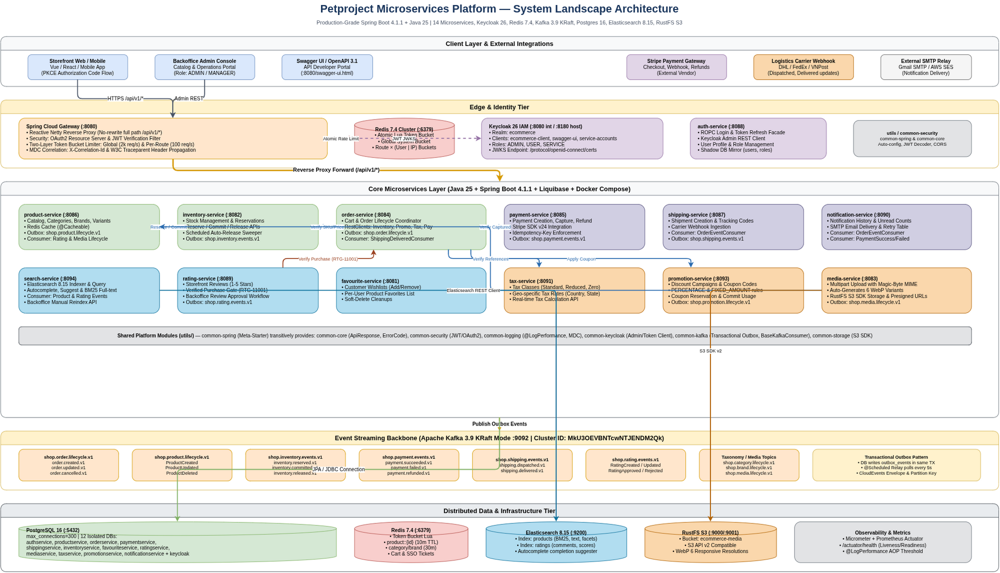

```mermaid
%% System Landscape C4 Context
flowchart TB
    classDef clientClass fill:#dae8fc,stroke:#6c8ebf,stroke-width:2px,color:#000000;
    classDef gatewayClass fill:#ffe6cc,stroke:#d79b00,stroke-width:2px,color:#000000;
    classDef authClass fill:#e1d5e7,stroke:#9673a6,stroke-width:2px,color:#000000;
    classDef coreServiceClass fill:#d5e8d4,stroke:#82b366,stroke-width:2px,color:#000000;
    classDef cxServiceClass fill:#b1ddf0,stroke:#10739e,stroke-width:2px,color:#000000;
    classDef pricingServiceClass fill:#fad7ac,stroke:#b46504,stroke-width:2px,color:#000000;
    classDef fulfillServiceClass fill:#d0cee2,stroke:#56517e,stroke-width:2px,color:#000000;
    classDef busClass fill:#fff2cc,stroke:#d6b656,stroke-width:2px,color:#000000;
    classDef storeClass fill:#f5f5f5,stroke:#666666,stroke-width:2px,color:#000000;

    subgraph CLIENTS ["Client Layer & External Actors"]
        WEB["Customer Web / Mobile App"]:::clientClass
        ADMIN["Backoffice Admin UI"]:::clientClass
        EXT_PAY["Stripe Payment Webhook"]:::clientClass
        EXT_SHIP["Logistics Carrier Webhook"]:::clientClass
    end

    subgraph EDGE ["Edge Tier"]
        GW["gateway-service :8080<br/>• Dual Token Bucket Rate Limiting<br/>• OAuth2 JWT Validation & JWKS<br/>• Correlation ID / MDC Tracing"]:::gatewayClass
    end

    subgraph IAM ["Identity & Access Tier"]
        KEYCLOAK["Keycloak 26 IAM (:8080 int / :9090 host)<br/>Realm: ecommerce"]:::authClass
        AUTH_SVC["auth-service :8088<br/>ROPC Login, Token Refresh, User Mirror"]:::authClass
    end

    subgraph CORE_COMMERCE ["Core Commerce Domain"]
        PRODUCT_SVC["product-service :8086<br/>Catalog, Brands, Categories, Variants"]:::coreServiceClass
        INV_SVC["inventory-service :8082<br/>2-Phase Stock Reservation & Commit"]:::coreServiceClass
        ORDER_SVC["order-service :8084<br/>Cart Management & Checkout Saga"]:::coreServiceClass
    end

    subgraph CUSTOMER_EXP ["Customer Experience Domain"]
        SEARCH_SVC["search-service :8094<br/>Elasticsearch 8.15 BM25 & Autocomplete"]:::cxServiceClass
        RATING_SVC["rating-service :8089<br/>Product Reviews & Verified Buyer Gate"]:::cxServiceClass
        FAV_SVC["favourite-service :8081<br/>Customer Wishlists & Saved Items"]:::cxServiceClass
    end

    subgraph PRICING_MEDIA ["Pricing, Tax & Media Domain"]
        TAX_SVC["tax-service :8091<br/>Tax Classes & Geo-Rates Engine"]:::pricingServiceClass
        PROMO_SVC["promotion-service :8093<br/>Coupons, Campaigns & Discounts"]:::pricingServiceClass
        MEDIA_SVC["media-service :8083<br/>MIME Validation & 6 WebP Variants"]:::pricingServiceClass
    end

    subgraph FULFILLMENT ["Fulfillment & Notification Domain"]
        PAY_SVC["payment-service :8085<br/>Payment Capture, Refunds & Stripe"]:::fulfillServiceClass
        SHIP_SVC["shipping-service :8087<br/>Shipment Tracking & Carrier Hooks"]:::fulfillServiceClass
        NOTIF_SVC["notification-service :8090<br/>In-App Alerts & SMTP Emails"]:::fulfillServiceClass
    end

    subgraph EVENT_BUS ["Event Streaming Backbone"]
        KAFKA["Apache Kafka 3.9 (KRaft Cluster :9092)<br/>Topics: order, product, inventory, payment, shipping, rating"]:::busClass
    end

    subgraph STORAGE ["Data Tier (Isolated Databases)"]
        PG[("PostgreSQL 16 (:5432)<br/>12 Isolated Service DBs + Keycloak DB")]:::storeClass
        REDIS[("Redis 7.4 (:6379)<br/>Rate Limiting & Catalog Cache")]:::storeClass
        ES[("Elasticsearch 8.15 (:9200)<br/>Full-text Search Indices")]:::storeClass
        RUSTFS[("RustFS S3 (:9000/:9001)<br/>ecommerce-media Object Store")]:::storeClass
    end

    %% Wiring
    CLIENTS -->|"HTTP REST /api/v1/*"| GW
    GW -.->|"JWKS Verify"| KEYCLOAK
    GW --> AUTH_SVC & PRODUCT_SVC & INV_SVC & ORDER_SVC & SEARCH_SVC & RATING_SVC & FAV_SVC & TAX_SVC & PROMO_SVC & MEDIA_SVC & PAY_SVC & SHIP_SVC & NOTIF_SVC
    AUTH_SVC <-->|"REST Admin API"| KEYCLOAK

    %% Synchronous Feign / RestClient Calls
    ORDER_SVC -->|"REST Verify Product"| PRODUCT_SVC
    ORDER_SVC -->|"REST 2PC Reserve/Commit"| INV_SVC
    ORDER_SVC -->|"REST Apply Coupon"| PROMO_SVC
    ORDER_SVC -->|"REST Calc Geo-Tax"| TAX_SVC
    ORDER_SVC -->|"REST Verify Captured"| PAY_SVC
    RATING_SVC -->|"REST /verify-purchase"| ORDER_SVC
    MEDIA_SVC <-->|"REST Verify Ref"| PRODUCT_SVC

    %% Outbox & Event Streaming
    PRODUCT_SVC & INV_SVC & ORDER_SVC & PAY_SVC & SHIP_SVC & RATING_SVC -->|"Transactional Outbox"| KAFKA
    KAFKA -->|"CDC Sync"| SEARCH_SVC
    KAFKA -->|"Order Confirmed"| SHIP_SVC
    KAFKA -->|"Delivery Event"| ORDER_SVC
    KAFKA -->|"Rating Approved"| PRODUCT_SVC
    KAFKA -->|"Dispatched / Paid / Created"| NOTIF_SVC

    %% Storage Backends
    AUTH_SVC & PRODUCT_SVC & INV_SVC & ORDER_SVC & PAY_SVC & SHIP_SVC & FAV_SVC & RATING_SVC & TAX_SVC & PROMO_SVC & MEDIA_SVC & NOTIF_SVC --> PG
    GW & PRODUCT_SVC <--> REDIS
    SEARCH_SVC <--> ES
    MEDIA_SVC <--> RUSTFS
```

---

## 2. Danh mục dịch vụ & Cổng mạng / Microservices Catalog

Toàn bộ nền tảng bao gồm **14 microservices độc lập**, tuân thủ nghiêm ngặt nguyên tắc **Database-per-Service** (không có dịch vụ nào truy cập chéo database của dịch vụ khác):

| Dịch vụ / Service | Port | Database Name | Chức năng chính / Responsibilities | Công nghệ chính | Healthcheck Endpoint |
|---|:---:|---|---|---|---|
| **`gateway-service`** | `8080` | *Không dùng* (Redis) | Cửa ngõ duy nhất, định tuyến không cắt tiền tố `/api/v1/*`, xác thực JWT Keycloak, giới hạn tần suất 2 lớp, gán `X-Correlation-Id`. | Spring Cloud Gateway, Netty, Redis Lua, Resilience4j | `http://localhost:8080/actuator/health` |
| **`auth-service`** | `8088` | `authservice` | Đăng nhập ROPC, Refresh token, Đăng xuất, Quản lý tài khoản người dùng, Đồng bộ Keycloak Admin REST API, Sổ địa chỉ giao hàng. | Spring Boot 4, Keycloak Admin, Spring Data JPA | `http://localhost:8088/actuator/health` |
| **`product-service`** | `8086` | `productservice` | Quản lý danh mục đa cấp (tree), thương hiệu, sản phẩm biến thể (SKU, thuộc tính), Redis Cache, Outbox relay. | Spring Boot 4, Redis Cache, PostgreSQL, Kafka Outbox | `http://localhost:8086/actuator/health` |
| **`inventory-service`** | `8082` | `inventoryservice` | Quản lý kho hàng, Đặt trước tồn kho 2 pha (`/reserve`, `/commit`, `/release`), Sweeper tự động nhả tồn kho hết hạn. | Spring Boot 4, Scheduled Sweeper, Kafka Outbox | `http://localhost:8082/actuator/health` |
| **`order-service`** | `8084` | `orderservice` | Quản lý giỏ hàng khách hàng, Điều phối Saga đặt hàng, RestClient bọc Resilience4j gọi Product/Promo/Tax/Inventory/Payment. | Spring Boot 4, Resilience4j, Kafka Outbox & Consumer | `http://localhost:8084/actuator/health` |
| **`payment-service`** | `8085` | `paymentservice` | Tích hợp Stripe PaymentIntent & Checkout, Xử lý webhook chữ ký số Stripe, Hoàn tiền (refund), Outbox relay. | Spring Boot 4, Stripe Java SDK, Kafka Outbox | `http://localhost:8085/actuator/health` |
| **`shipping-service`** | `8087` | `shippingservice` | Tiếp nhận đơn xác nhận, Tạo vận đơn & mã tracking, Tiếp nhận webhook đối tác vận chuyển (DHL/FedEx), Cập nhật trạng thái giao. | Spring Boot 4, Kafka Consumer & Outbox Relay | `http://localhost:8087/actuator/health` |
| **`rating-service`** | `8089` | `ratingservice` | Đánh giá 1-5 sao kèm bình luận, Kiểm tra điều kiện người mua xác thực (Verified Buyer Gate `RTG-11001` qua `order-service`). | Spring Boot 4, Feign/RestClient, Kafka Outbox | `http://localhost:8089/actuator/health` |
| **`search-service`** | `8094` | *Elasticsearch* | Động cơ tìm kiếm toàn văn BM25, Gợi ý tự động (Autocomplete prefix suggester), Đồng bộ CDC thời gian thực từ Kafka. | Spring Boot 4, Elasticsearch 8.15 Java Client | `http://localhost:8094/actuator/health` |
| **`tax-service`** | `8091` | `taxservice` | Danh mục thuế suất, Tính thuế dựa trên phân loại sản phẩm và địa lý (quốc gia, bang, mã bưu chính). | Spring Boot 4, Spring Data JPA, PostgreSQL | `http://localhost:8091/actuator/health` |
| **`promotion-service`** | `8093` | `promotionservice` | Quản lý chiến dịch khuyến mãi, mã giảm giá (% hoặc số tiền cố định), điều kiện giá trị đơn tối thiểu, giữ và trừ lượt dùng mã. | Spring Boot 4, Spring Data JPA, PostgreSQL | `http://localhost:8093/actuator/health` |
| **`favourite-service`** | `8081` | `favouriteservice` | Danh sách sản phẩm yêu thích (Wishlist) của từng khách hàng, thêm/xóa/kiểm tra trạng thái sản phẩm yêu thích. | Spring Boot 4, Spring Data JPA, PostgreSQL | `http://localhost:8081/actuator/health` |
| **`media-service`** | `8083` | `mediaservice` | Tải lên đa phương tiện, Kiểm tra mã định danh file (MIME sniffing), Tạo tự động 6 phiên bản WebP responsive, Presigned S3 URLs. | Spring Boot 4, RustFS/S3 SDK, ImageIO/WebP | `http://localhost:8083/actuator/health` |
| **`notification-service`**| `8090` | `notificationservice` | Trung tâm thông báo đa kênh, Gửi email SMTP tự động khi đặt hàng thành công, thanh toán xác nhận, cập nhật hành trình vận chuyển. | Spring Boot 4, JavaMailSender, Kafka Consumers | `http://localhost:8090/actuator/health` |

---

## 3. Quy trình luồng nghiệp vụ chi tiết / Business & Functional Flows

Dưới đây là sơ đồ chi tiết và cơ chế vận hành của tất cả 9 luồng nghiệp vụ chính trong toàn bộ hệ thống mã nguồn:

### Flow 1: Xác thực & Điều hướng Gateway (IAM & Edge Routing)

Quy trình đăng nhập ROPC (Resource Owner Password Credentials), phát hành JWT từ Keycloak, đồng bộ thông tin người dùng cục bộ và quy trình kiểm soát an ninh tại API Gateway.

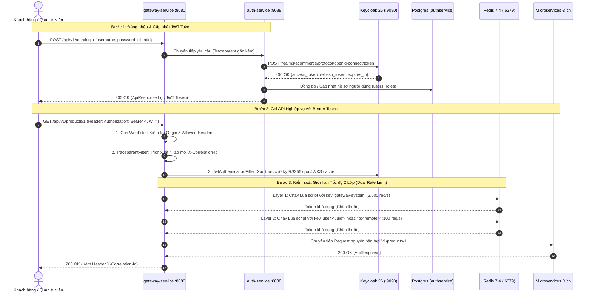

---

### Flow 2: Quản lý Danh mục & Đồng bộ CDC Tìm kiếm (Catalog & Search Sync)

Khi Quản trị viên thêm, sửa hoặc xóa sản phẩm, hệ thống sử dụng **Transactional Outbox Pattern** để đảm bảo dữ liệu ghi vào PostgreSQL và sự kiện Kafka hoàn toàn nhất quán, từ đó `search-service` tự động cập nhật chỉ mục tìm kiếm Elasticsearch và làm mới cache Redis.

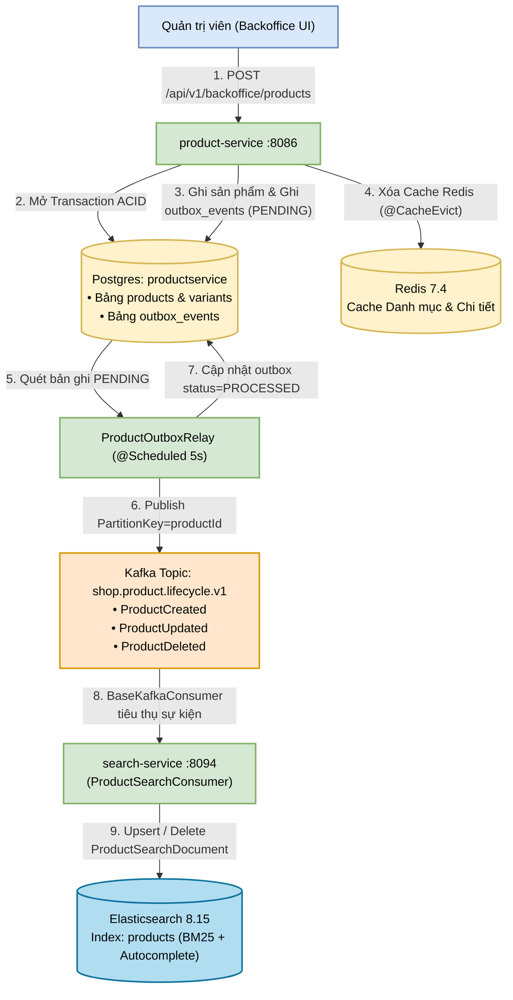

---

### Flow 3: Xử lý Đa phương tiện & Tạo ảnh Responsive (Media Processing Pipeline)

Hệ thống lưu trữ ảnh sản phẩm an toàn với cơ chế **MIME Type Sniffing** (đọc magic bytes để ngăn chặn tấn công giả mạo đuôi file), tự động sản sinh 6 kích thước ảnh WebP phục vụ giao diện Responsive và cấp phát Presigned URL từ RustFS S3.

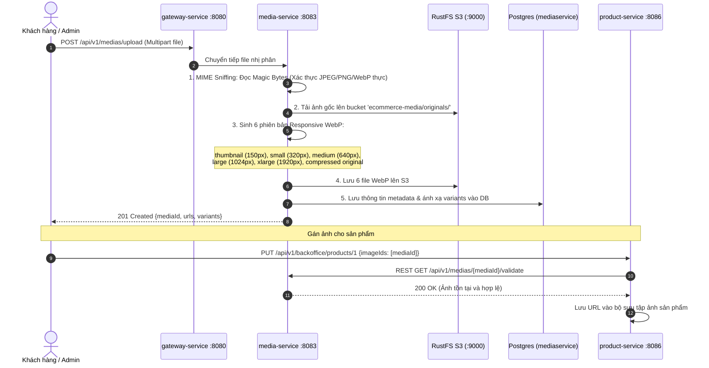

---

### Flow 4: Trải nghiệm Khách hàng: Yêu thích, Giỏ hàng & Giá động (Wishlist, Cart & Pricing)

Quá trình khách hàng tương tác với danh sách yêu thích, thêm sản phẩm vào giỏ hàng và hệ thống tự động tính toán chiết khấu khuyến mãi cùng mức thuế địa lý theo thời gian thực.

```mermaid
flowchart LR
    classDef client fill:#dae8fc,stroke:#6c8ebf,stroke-width:2px,color:#000000;
    classDef service fill:#d5e8d4,stroke:#82b366,stroke-width:2px,color:#000000;

    USER["Khách hàng"]:::client
    GW["gateway-service :8080"]:::service
    FAV["favourite-service :8081<br/>Wishlist & Sản phẩm lưu"]:::service
    CART["order-service :8084<br/>Giỏ hàng (Carts & CartItems)"]:::service
    PROMO["promotion-service :8093<br/>Mã giảm giá & Điều kiện áp dụng"]:::service
    TAX["tax-service :8091<br/>Tính thuế theo vị trí địa lý"]:::service

    USER -->|"1. Thêm vào Wishlist"| GW --> FAV
    USER -->|"2. Thêm vào giỏ hàng (Cart)"| GW --> CART
    CART -->|"3. Gửi mã coupon & tổng tiền"| PROMO
    PROMO -->>|"4. Trả về mức giảm (% hoặc số tiền)"| CART
    CART -->|"5. Gửi TaxClass & Quốc gia/Bang"| TAX
    TAX -->>|"6. Trả về tiền thuế & thuế suất"| CART
    CART -->>|"7. Tổng hợp: Tạm tính - Giảm giá + Thuế = Tổng tiền"| USER
```

---

### Flow 5: Đặt hàng & Đặt trước Tồn kho 2 Pha (Order Checkout & 2-Phase Reservation)

Quy trình cốt lõi khi khách hàng bấm **Checkout**. Đảm bảo không xảy ra hiện tượng bán vượt tồn kho (overselling) nhờ **2-Phase Stock Reservation**, kiểm tra giá và phân loại thuế đồng bộ, sau đó bắn sự kiện sang Kafka.

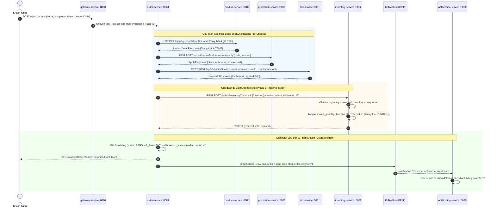

---

### Flow 6: Xử lý Thanh toán Stripe & Xác nhận Đơn hàng (Payment & Order Confirmation)

Khách hàng tiến hành thanh toán qua Stripe. Hệ thống đón Webhook với chữ ký số bảo mật, sau đó kích hoạt **Phase 2 Commit** để chính thức trừ kho vật lý và xác nhận đơn hàng.

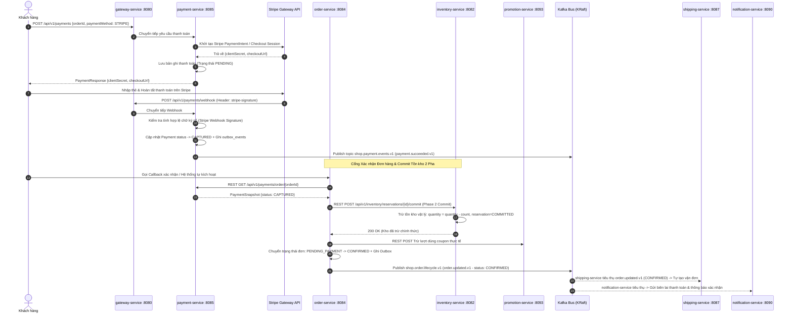

---

### Flow 7: Vận chuyển Đơn hàng & Tự động Giao hàng (Logistics & Auto-Delivery)

Quy trình giao hàng khép kín từ khi đơn hàng được xác nhận, tự động đóng gói, liên kết đối tác vận chuyển, xử lý webhook hành trình và tự động hoàn thành đơn khi khách nhận hàng thành công.

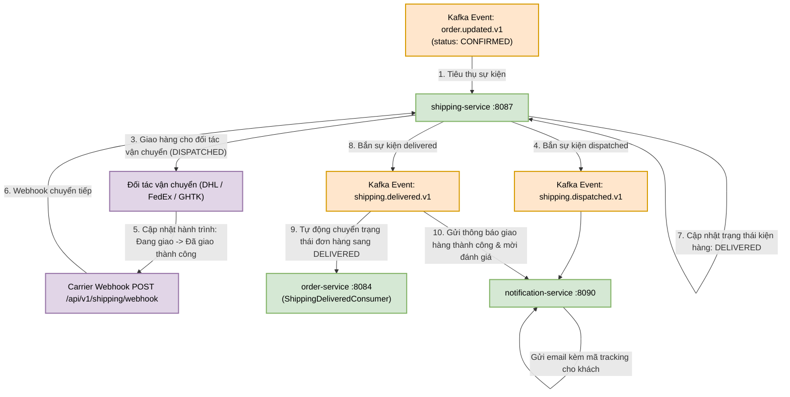

---

### Flow 8: Đánh giá Người mua Xác thực (Verified Buyer Review & Rating)

Chỉ những khách hàng đã thực sự mua sản phẩm và đơn hàng ở trạng thái `DELIVERED` mới được phép gửi đánh giá (chặn triệt để đánh giá ảo/spam thông qua **Eligibility Gate `RTG-11001`**). Sau khi đánh giá được duyệt, điểm xếp hạng trung bình sẽ tự động cập nhật vào Catalog và đẩy độ ưu tiên tìm kiếm trên Elasticsearch.

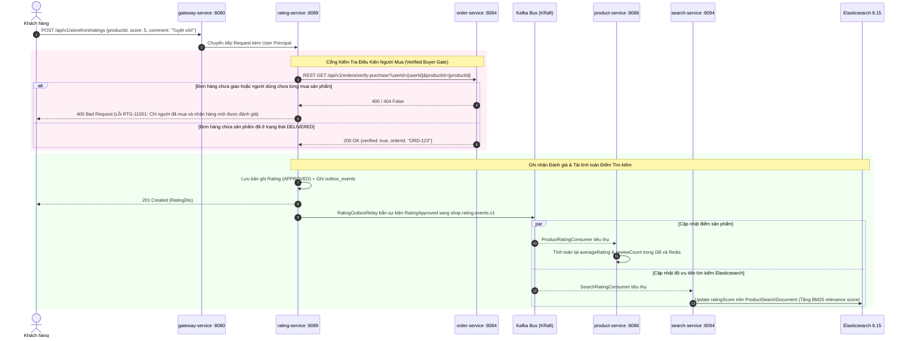

---

### Flow 9: Xử lý Sự cố, Quét Tồn kho Hết hạn & Hoàn tác (Sweeper & Compensations)

Cơ chế tự bảo vệ và đảm bảo tính nhất quán cuối cùng (Eventual Consistency) khi gặp sự cố mạng, hủy đơn hoặc người dùng từ bỏ thanh toán:

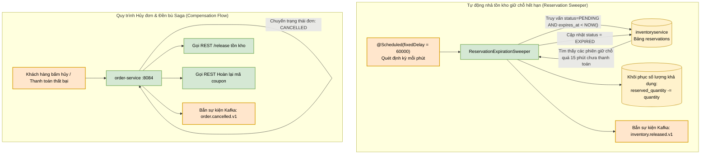

---

## 4. Hạ tầng Bắn Sự kiện & Bảng Mapping Kafka (Event-Driven Backbone)

Nền tảng sử dụng cụm **Apache Kafka 3.9 vận hành ở chế độ KRaft** (không phụ thuộc Zookeeper), với cam kết phân vùng rõ ràng đảm bảo thứ tự sự kiện theo ID nghiệp vụ:

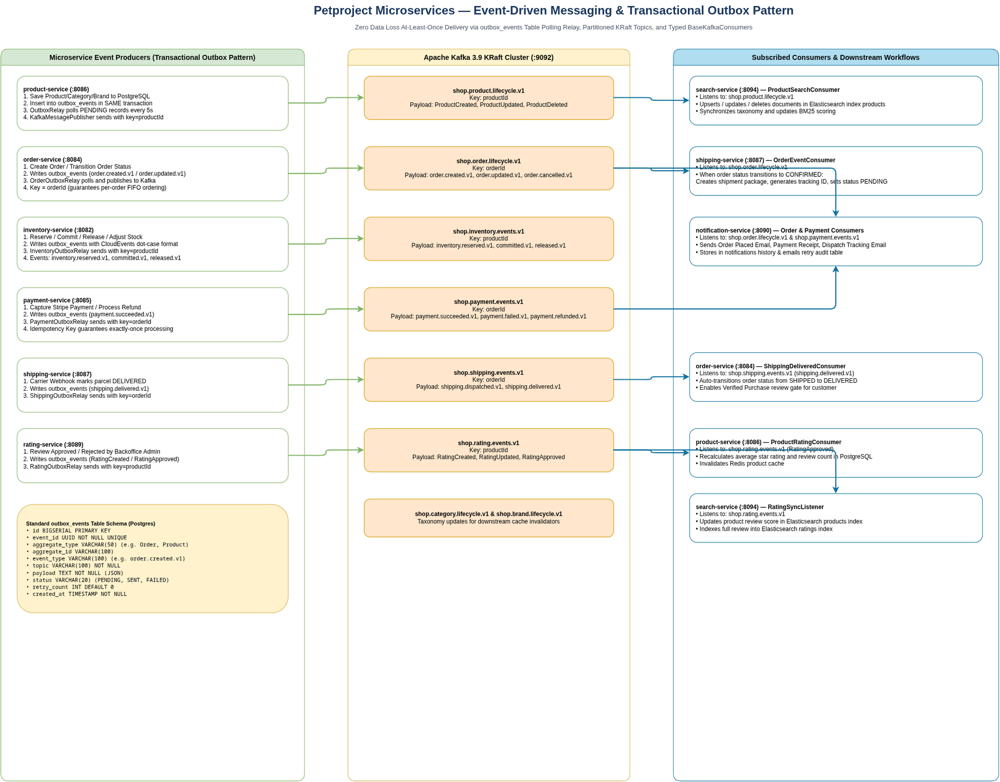

| Kafka Topic | Dịch vụ Sản sinh (Producer) | Partition Key | Tên sự kiện / Event Types | Dịch vụ Tiêu thụ & Hành động (Consumers) |
|---|---|---|---|---|
| **`shop.order.lifecycle.v1`** | `order-service` | `orderId` | `order.created.v1`<br/>`order.updated.v1`<br/>`order.cancelled.v1` | • **`shipping-service`**: Tạo vận đơn khi đơn đạt `CONFIRMED`.<br/>• **`notification-service`**: Gửi email xác nhận đặt hàng & cập nhật tiến độ. |
| **`shop.product.lifecycle.v1`** | `product-service` | `productId` | `ProductCreated`<br/>`ProductUpdated`<br/>`ProductDeleted` | • **`search-service`**: Thêm mới, cập nhật hoặc xóa chỉ mục Elasticsearch `products`. |
| **`shop.inventory.events.v1`** | `inventory-service` | `productId` | `inventory.reserved.v1`<br/>`inventory.committed.v1`<br/>`inventory.released.v1`<br/>`inventory.adjusted.v1` | • **`order-service`**: Giám sát tồn kho phân tán theo thời gian thực.<br/>• **Kiểm toán & Báo cáo kho**: Audit log biến động kho. |
| **`shop.payment.events.v1`** | `payment-service` | `orderId` | `payment.succeeded.v1`<br/>`payment.failed.v1`<br/>`payment.refunded.v1` | • **`notification-service`**: Gửi biên lai thanh toán hoặc cảnh báo lỗi.<br/>• **`order-service`**: Bật cờ cho phép xác nhận đơn hàng. |
| **`shop.shipping.events.v1`** | `shipping-service` | `orderId` | `shipping.dispatched.v1`<br/>`shipping.delivered.v1` | • **`order-service`**: Tự động chuyển đơn sang `DELIVERED` khi nhận sự kiện giao thành công.<br/>• **`notification-service`**: Gửi mã vận đơn tracking URL đến email khách hàng. |
| **`shop.rating.events.v1`** | `rating-service` | `productId` | `RatingCreated`<br/>`RatingApproved`<br/>`RatingRejected` | • **`product-service`**: Tính lại điểm trung bình sao và tổng số đánh giá.<br/>• **`search-service`**: Cập nhật điểm uy tín sản phẩm vào chỉ mục tìm kiếm ES. |
| **`shop.media.lifecycle.v1`** | `media-service` | `mediaId` | `MediaDeleted` | • **`product-service`**: Xóa liên kết ảnh trong gallery sản phẩm. |

---

## 5. Bảo mật Cửa ngõ & Giới hạn Tốc độ 2 Lớp (Edge Security & Dual Rate Limit)

Tại lớp cửa ngõ (`gateway-service`), một đường ống lọc phi phong tỏa (non-blocking reactive filter pipeline) được thiết lập để phòng thủ trước các đợt tấn công từ chối dịch vụ (DDoS) và lưu lượng truy cập đột biến (Flash Sales):

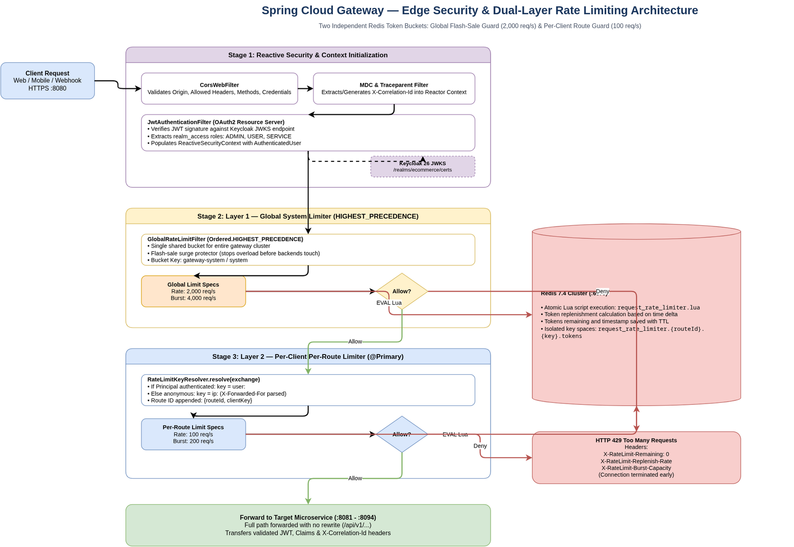

### Cơ chế 2 tầng Token Bucket:
1. **Tầng 1 - Global System Rate Limiter (Bảo vệ toàn cụm)**:
   - **Filter**: `GlobalRateLimitFilter` (`Order: HIGHEST_PRECEDENCE + 1`)
   - **Key**: Cố định `gateway-system`
   - **Hạn mức**: **2.000 req/giây** (Burst: **4.000 requests**)
   - **Mục đích**: Bảo vệ tổng năng lực xử lý của hạ tầng backend, ngăn chặn sập server khi toàn bộ người dùng đổ dồn vào giờ săn sale.
2. **Tầng 2 - Per-Client Per-Route Rate Limiter (Chia sẻ công bằng & Chống spam)**:
   - **Filter**: `RequestRateLimiterGatewayFilterFactory`
   - **Key Resolver**: Nếu đã đăng nhập $\rightarrow$ `user:<uuid>`, nếu ẩn danh $\rightarrow$ `ip:<client-ip>` ghép cùng `routeId`.
   - **Hạn mức**: **100 req/giây** (Burst: **200 requests**)
   - **Mục đích**: Cách ly người dùng gửi request bất thường, chống cào dữ liệu (scraping) và đảm bảo chất lượng dịch vụ (QoS) cho mọi khách hàng khác.

Nếu vượt ngưỡng ở bất kỳ tầng nào, Gateway lập tức phản hồi **HTTP 429 Too Many Requests** mà không chuyển tiếp yêu cầu vào các dịch vụ phía sau.

---

## 6. Thư viện Dùng chung Nền tảng (`utils/`)

Mã nguồn được tổ chức theo triết lý tái sử dụng tối đa, các quy chuẩn về bảo mật, định dạng dữ liệu, ngoại lệ và ghi log được đóng gói trong thư mục `utils/`:

- **`common-core`**: Định nghĩa khuôn mẫu phản hồi chuẩn `ApiResponse<T>`, danh mục mã lỗi toàn hệ thống `ErrorCode`, phân trang `PageResponse<T>`, và các ngoại lệ cơ sở `AppException`.
- **`common-spring`**: Spring Boot Starter đóng gói sẵn cấu hình Validation, Exception Handler toàn cục, Swagger OpenAPI, Jackson Datetime format, ModelMapper, Dotenv loader và Micrometer Metrics.
- **`common-security`**: Cấu hình Spring Security 6 Resource Server, bộ chuyển đổi vai trò Keycloak Realm Roles (`ROLE_CUSTOMER`, `ROLE_ADMIN`), và tiện ích `SecurityUtils`.
- **`common-logging`**: Aspect lập hồ sơ hiệu năng `@LogExecutionTime`, gắn và lan truyền vết phân tán W3C `traceparent` và `X-Correlation-Id` qua MDC.
- **`common-keycloak`**: Keycloak Admin Client abstraction, phục vụ đăng ký tài khoản, phân quyền và quản lý realm từ code Java.
- **`common-kafka`**: Cấu hình Producer/Consumer chuẩn hóa, bọc `BaseKafkaConsumer` với cơ chế Dead-Letter Queue (DLQ), retry backoff và bảo vệ tính lũy thoái (idempotency).
- **`common-storage`**: SDK trừu tượng hóa thao tác với RustFS/S3 (Upload, Delete, kiểm tra tồn tại, tạo Presigned URL có thời hạn).

---

## 7. Hướng dẫn Cài đặt & Khởi chạy (Local Development Guide)

### Yêu cầu tiên quyết (Prerequisites)

- **Hệ điều hành**: Linux (Ubuntu 22.04+ khuyên dùng), macOS (Apple Silicon / Intel), hoặc Windows 11 WSL2.
- **Java**: **JDK 25 (Temurin LTS / OpenJDK 25)**.
- **Maven**: 3.9+ (hoặc dùng trực tiếp `./mvnw` đi kèm repository).
- **Docker**: 24+ & **Docker Compose** v2+.
- **RAM tối thiểu**: 16 GB (khuyến nghị 32 GB để chạy toàn bộ 14 dịch vụ cùng hạ tầng).

### Bước 1: Khởi động Hạ tầng Docker

Repository cung cấp cấu hình Docker Compose đã được tối ưu hóa sẵn, khởi tạo toàn bộ 12 cơ sở dữ liệu PostgreSQL độc lập, Redis, KRaft Kafka, Elasticsearch có bảo mật và Keycloak tự động import Realm:

```bash
# 1. Sao chép file cấu hình môi trường
cp .env.example .env

# 2. Khởi động các container hạ tầng cốt lõi ở chế độ nền
docker compose up -d postgres redis kafka elasticsearch keycloak rustfs

# 3. Kiểm tra trạng thái hoạt động của hạ tầng (chờ đến khi tất cả chuyển sang healthy)
docker compose ps
```

> [!TIP]
> Script tiện ích: Bạn có thể chạy `./start-docker.sh` để tự động kiểm tra và khởi động toàn bộ hạ tầng kèm healthcheck.

### Bước 2: Cấu hình Môi trường & Build Java 25

Dự án sử dụng cơ chế **Maven JDK Toolchains** để đảm bảo luôn biên dịch chính xác bằng Java 25.

1. **Cấu hình toolchain (Tạo file `~/.m2/toolchains.xml`)**:
   ```xml
   <?xml version="1.0" encoding="UTF-8"?>
   <toolchains xmlns="http://maven.apache.org/TOOLCHAINS/1.1.0"
              xmlns:xsi="http://www.w3.org/2001/XMLSchema-instance"
              xsi:schemaLocation="http://maven.apache.org/TOOLCHAINS/1.1.0 http://maven.apache.org/xsd/toolchains-1.1.0.xsd">
       <toolchain>
           <type>jdk</type>
           <provides>
               <version>25</version>
               <vendor>temurin</vendor>
           </provides>
           <configuration>
               <!-- Đường dẫn JDK 25 trên máy của bạn -->
               <jdkHome>/usr/lib/jvm/java-25-openjdk</jdkHome>
           </configuration>
       </toolchain>
   </toolchains>
   ```

2. **Biên dịch và kiểm tra chất lượng code (Checkstyle validation)**:
   ```bash
   # Thiết lập biến JAVA_HOME và tiến hành biên dịch toàn bộ 23 modules
   export JAVA_HOME=/usr/lib/jvm/java-25-openjdk
   ./mvnw clean compile

   # Chạy kiểm tra quy chuẩn Checkstyle (Bắt buộc 0 lỗi vi phạm)
   ./mvnw -T1C validate
   ```

### Bước 3: Khởi chạy Microservices

Bạn có thể chạy thử từng dịch vụ trên máy cục bộ hoặc đóng gói container:

- **Chạy một dịch vụ đơn lẻ trong môi trường phát triển**:
  ```bash
  # Chạy Gateway Service
  ./mvnw -pl gateway-service spring-boot:run

  # Chạy Auth Service
  ./mvnw -pl auth-service spring-boot:run

  # Chạy Product Service
  ./mvnw -pl product-service spring-boot:run
  ```

- **Đóng gói Docker Image nội bộ và chạy toàn bộ cụm qua Docker**:
  ```bash
  # Build Docker images bằng Google Jib (không cần Dockerfile riêng)
  ./mvnw clean package jib:dockerBuild -DskipTests

  # Khởi chạy toàn bộ hệ sinh thái (Hạ tầng + 14 Services)
  docker compose up -d
  ```

---

## 8. Kiểm thử Tự động & Giám sát Hệ thống (Testing & Observability)

### Bộ Test Postman & Newman E2E
Hệ thống cung cấp **01 Bộ Test Postman Master duy nhất** (`petproject-comprehensive.postman_collection.json`) gồm **190 requests** được phân chia rõ ràng thành 3 tầng:
1. **PART 1: E2E Business Lifecycle (41 requests)**: Luồng nghiệp vụ liên hoàn từ Auth -> Catalog -> Inventory 2PC -> Cart -> Public Guest Tracking -> Thanh toán đa cổng (Stripe, VNPay, MoMo, COD) -> Vận chuyển 3 trạng thái -> Đánh giá verified-purchaser -> Quy trình RMA hoàn hàng (Customer Request & Backoffice Approval) -> Search Elasticsearch & Thông báo.
2. **PART 2: Edge Cases & Security Audits (23 requests)**: Kiểm thử biên & bảo mật toàn diện: 401 Unauthorized (sai mật khẩu, token dị dạng), 403 Forbidden (RBAC chặn regular user vào admin API, buyer verification chặn đánh giá ảo), 400/422 Validation (giá âm, số lượng giỏ hàng bằng 0, mã quốc gia sai), 409 Conflict (đặt trước vượt tồn kho `INV-3002`), 401 Webhook HMAC signature giả mạo (`PAY-5005`, `SHP-10004`), 400 Non-multipart media upload.
3. **PART 3: Fleet Service Catalog (126 requests)**: Danh mục toàn bộ API endpoints của đầy đủ 14 microservices phục vụ tra cứu và gọi ad-hoc.

```bash
# 1. Chạy toàn bộ Master Suite (190 requests - tỷ lệ đỗ 100%)
npx --yes newman run docs/postman/petproject-comprehensive.postman_collection.json

# 2. Chạy nhanh bộ E2E Flow & Edge Cases cho CI/CD (<2s)
npx --yes newman run docs/postman/petproject-e2e-business-flow.postman_collection.json --bail
```

### Tài liệu API Trực quan (Swagger OpenAPI 3.1)
Khi các dịch vụ đang chạy, bạn có thể truy cập giao diện tương tác Swagger UI tại cổng của từng dịch vụ:
- Gateway Service: `http://localhost:8080/swagger-ui.html`
- Auth Service: `http://localhost:8088/swagger-ui.html`
- Product Service: `http://localhost:8086/swagger-ui.html`
- Order Service: `http://localhost:8084/swagger-ui.html`
- Inventory Service: `http://localhost:8082/swagger-ui.html`
- Payment Service: `http://localhost:8085/swagger-ui.html`
- Shipping Service: `http://localhost:8087/swagger-ui.html`
- Rating Service: `http://localhost:8089/swagger-ui.html`
- Promotion Service: `http://localhost:8093/swagger-ui.html`
- Tax Service: `http://localhost:8091/swagger-ui.html`
- Search Service: `http://localhost:8094/swagger-ui.html`
- Media Service: `http://localhost:8083/swagger-ui.html`
- Favourite Service: `http://localhost:8081/swagger-ui.html`
- Notification Service: `http://localhost:8090/swagger-ui.html`

### Giám sát Sức khỏe & Chỉ số Đo lường (Actuator & Prometheus)
Tất cả microservices đều tích hợp **Spring Boot Actuator** và **Micrometer**:
- Kiểm tra trạng thái dịch vụ: `GET http://localhost:<port>/actuator/health`
- Xem metrics phục vụ Prometheus thu thập: `GET http://localhost:<port>/actuator/prometheus`
- Thông tin phiên bản & git commit: `GET http://localhost:<port>/actuator/info`

---

## 9. Tài liệu Kỹ thuật Chi tiết (Architecture Blueprint Links)

Để tìm hiểu sâu hơn về từng thành phần kiến trúc, sơ đồ Draw.io gốc có thể chỉnh sửa và các bài phân tích kỹ thuật, mời bạn tham khảo tài liệu trong thư mục `docs/`:

- 📘 [**Master Architecture Blueprint (`docs/FULL-ARCHITECTURE.md`)**](./docs/FULL-ARCHITECTURE.md) — Tài liệu kiến trúc toàn diện 500+ dòng phân tích chuyên sâu.
- 📐 [**Sơ đồ Draw.io & HTML tương tác (`docs/architecture/`)**](./docs/architecture/)
  - [System Landscape Architecture (Draw.io)](./docs/architecture/system-landscape-architecture.drawio) | [HTML Viewer](./docs/architecture/system-landscape-architecture.html)
  - [Event-Driven Messaging & Outbox (Draw.io)](./docs/architecture/event-driven-messaging-architecture.drawio) | [HTML Viewer](./docs/architecture/event-driven-messaging-architecture.html)
  - [E2E Order Fulfillment Saga (Draw.io)](./docs/architecture/e2e-order-fulfillment-saga.drawio) | [HTML Viewer](./docs/architecture/e2e-order-fulfillment-saga.html)
  - [Gateway Security & Dual Rate Limit (Draw.io)](./docs/architecture/gateway-security-rate-limit.drawio) | [HTML Viewer](./docs/architecture/gateway-security-rate-limit.html)
  - [Data Stores & Infrastructure Topology (Draw.io)](./docs/architecture/data-stores-infrastructure-topology.drawio) | [HTML Viewer](./docs/architecture/data-stores-infrastructure-topology.html)
- 🛡️ [**Chiến lược Giới hạn Tốc độ Gateway (`docs/RATE-LIMIT.md`)**](./docs/RATE-LIMIT.md)
- 🧩 [**Khuôn mẫu Thiết kế Hệ thống (`docs/PATTERNS.md`)**](./docs/PATTERNS.md)
- 🚀 [**Sẵn sàng cho Môi trường Production (`docs/PRODUCTION-READINESS.md`)**](./docs/PRODUCTION-READINESS.md)

---

<p align="center">
  <b>Petproject Microservices Platform</b> • Built with modern Java 25 & Spring Boot 4.1.1
</p>
