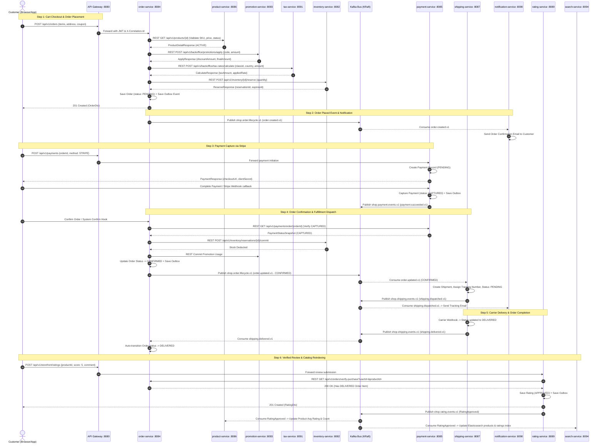
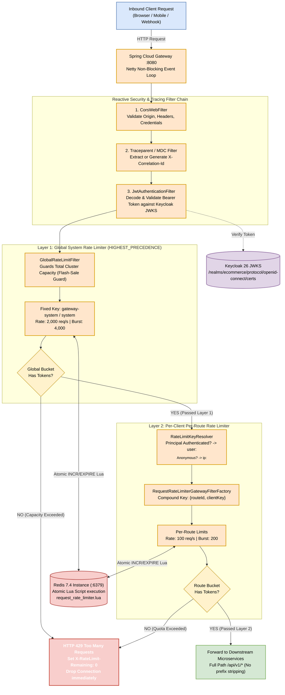
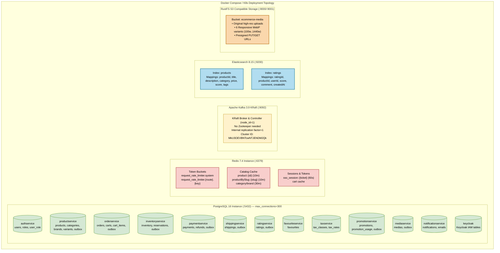

# Petproject Microservices Platform — Master Architecture Blueprint

> **System Overview**: Production-grade e-commerce microservices platform built with **Java 25 (OpenJDK / Temurin)** and **Spring Boot 4.1.1**, managed as a Maven reactor of 23 modules (14 microservices + 8 common shared libraries + parent aggregator).  
> **Key Infrastructure**: Keycloak 26 (OAuth2/OIDC), PostgreSQL 16 (12 isolated service DBs + Keycloak DB), Redis 7.4 (Caching & Token Bucket Rate Limiting), Apache Kafka 3.9 (KRaft mode, no Zookeeper), Elasticsearch 8.15 (Catalog search & autocomplete), RustFS (High-performance S3-compatible media storage).

---

## Architecture Diagram Suite Quick Links

All diagrams have been produced in both **Mermaid (.mmd)** and native **Draw.io (.drawio)** with editable embedded XML, and exported to high-resolution **SVG**, **PNG**, and **Interactive HTML Viewers**:

| Diagram | Focus Area | Mermaid Source | Draw.io XML | SVG Vector | Rendered PNG | Interactive Viewer |
|---|---|---|---|---|---|---|
| **1. System Landscape** | C4 Context & Microservices Domains | [system-landscape.mmd](./architecture/system-landscape-architecture.mmd) | [system-landscape.drawio](./architecture/system-landscape-architecture.drawio) | [SVG](./images/system-landscape-architecture.svg) | [PNG](./images/system-landscape-architecture.png) | [HTML Viewer](./architecture/system-landscape-architecture.html) |
| **2. Event-Driven Backbone** | Kafka Topics & Transactional Outbox | [event-driven.mmd](./architecture/event-driven-messaging-architecture.mmd) | [event-driven.drawio](./architecture/event-driven-messaging-architecture.drawio) | [SVG](./images/event-driven-messaging-architecture.svg) | [PNG](./images/event-driven-messaging-architecture.png) | [HTML Viewer](./architecture/event-driven-messaging-architecture.html) |
| **3. Order Fulfillment Saga** | E2E Choreography & Stock Reservation | [order-saga.mmd](./architecture/e2e-order-fulfillment-saga.mmd) | [order-saga.drawio](./architecture/e2e-order-fulfillment-saga.drawio) | [SVG](./images/e2e-order-fulfillment-saga.svg) | [PNG](./images/e2e-order-fulfillment-saga.png) | [HTML Viewer](./architecture/e2e-order-fulfillment-saga.html) |
| **4. Edge Security & Rate Limit** | Gateway Filters & Dual Token Buckets | [gateway-security.mmd](./architecture/gateway-security-rate-limit.mmd) | [gateway-security.drawio](./architecture/gateway-security-rate-limit.drawio) | [SVG](./images/gateway-security-rate-limit.svg) | [PNG](./images/gateway-security-rate-limit.png) | [HTML Viewer](./architecture/gateway-security-rate-limit.html) |
| **5. Data Stores & Infra** | 12 Postgres DBs, Redis, ES, RustFS | [data-stores.mmd](./architecture/data-stores-infrastructure-topology.mmd) | [data-stores.drawio](./architecture/data-stores-infrastructure-topology.drawio) | [SVG](./images/data-stores-infrastructure-topology.svg) | [PNG](./images/data-stores-infrastructure-topology.png) | [HTML Viewer](./architecture/data-stores-infrastructure-topology.html) |

---

## 1. System Landscape & High-Level Architecture (C4 Landscape)

The system is architected around **Domain-Driven Design (DDD)** and the **Database-per-Service** pattern. Traffic enters through a reactive Spring Cloud Gateway which enforces authentication, tracing, and rate limiting before routing to the backend services.

```mermaid
%% System Landscape Architecture — Petproject Microservices Platform
flowchart TB
    classDef clientClass fill:#dae8fc,stroke:#6c8ebf,stroke-width:2px,color:#000000;
    classDef gatewayClass fill:#ffe6cc,stroke:#d79b00,stroke-width:2px,color:#000000;
    classDef authClass fill:#e1d5e7,stroke:#9673a6,stroke-width:2px,color:#000000;
    classDef coreServiceClass fill:#d5e8d4,stroke:#82b366,stroke-width:2px,color:#000000;
    classDef cxServiceClass fill:#b1ddf0,stroke:#10739e,stroke-width:2px,color:#000000;
    classDef pricingServiceClass fill:#fad7ac,stroke:#b46504,stroke-width:2px,color:#000000;
    classDef fulfillServiceClass fill:#d0cee2,stroke:#56517e,stroke-width:2px,color:#000000;
    classDef busClass fill:#fff2cc,stroke:#d6b656,stroke-width:2px,color:#000000;
    classDef storeClass fill:#f5f5f5,stroke:#666666,stroke-width:2px,color:#000000;
    classDef extClass fill:#e6e6e6,stroke:#808080,stroke-dasharray: 5 5,color:#000000;

    subgraph CLIENTS ["Client Layer & External Actors"]
        WEB["Customer Web / Mobile App"]:::clientClass
        ADMIN_UI["Backoffice Admin UI"]:::clientClass
        STRIPE_EXT["Stripe Payment Gateway"]:::extClass
        CARRIER_EXT["Logistics Carrier Webhook (DHL/FedEx)"]:::extClass
    end

    subgraph EDGE ["Edge & Gateway Tier"]
        GW["Spring Cloud Gateway :8080<br/>• Dual-Layer Rate Limiting (Redis)<br/>• OAuth2 JWT Validation<br/>• X-Correlation-Id & Traceparent<br/>• Dynamic CORS & Error Enveloping"]:::gatewayClass
    end

    subgraph IDENTITY ["Identity & Access Tier"]
        KEYCLOAK["Keycloak 26 (IAM :8080/:8180)<br/>Realm: ecommerce<br/>OAuth2.0 / OIDC / JWKS"]:::authClass
        AUTH_SVC["auth-service :8088<br/>ROPC Login, Refresh, User & Role Facade"]:::authClass
    end

    subgraph CORE_COMMERCE ["Core Commerce Domain"]
        PRODUCT_SVC["product-service :8086<br/>Catalog, Brands, Categories, Variants<br/>Redis Cache + Outbox Relay"]:::coreServiceClass
        INVENTORY_SVC["inventory-service :8082<br/>Stock Reservations & Commit / Release"]:::coreServiceClass
        ORDER_SVC["order-service :8084<br/>Carts, Order Checkout Saga & Outbox Relay"]:::coreServiceClass
    end

    subgraph CUSTOMER_EXP ["Customer Experience Domain"]
        SEARCH_SVC["search-service :8094<br/>Elasticsearch 8.15 Full-Text & Auto-suggest"]:::cxServiceClass
        RATING_SVC["rating-service :8089<br/>Storefront Reviews & Verified Purchase Gate"]:::cxServiceClass
        FAV_SVC["favourite-service :8081<br/>Customer Wishlists & Saved Items"]:::cxServiceClass
    end

    subgraph PRICING_MEDIA ["Pricing, Tax & Media Domain"]
        TAX_SVC["tax-service :8091<br/>Tax Classes & Geo-Rates Calculator"]:::pricingServiceClass
        PROMO_SVC["promotion-service :8093<br/>Coupons, Campaigns & Discount Calculator"]:::pricingServiceClass
        MEDIA_SVC["media-service :8083<br/>MIME Verification & 6 WebP Variants"]:::pricingServiceClass
    end

    subgraph FULFILLMENT ["Fulfillment & Communications Domain"]
        PAYMENT_SVC["payment-service :8085<br/>Payment Capture, Refund, Stripe Client"]:::fulfillServiceClass
        SHIPPING_SVC["shipping-service :8087<br/>Shipment Tracking, Carrier Webhooks"]:::fulfillServiceClass
        NOTIF_SVC["notification-service :8090<br/>In-App Alerts & SMTP Email Dispatch"]:::fulfillServiceClass
    end

    subgraph BUS ["Event Streaming Backbone"]
        KAFKA["Apache Kafka 3.9 (KRaft Cluster :9092)<br/>Topics: shop.order.lifecycle.v1, shop.product.lifecycle.v1, shop.inventory.events.v1,<br/>shop.payment.events.v1, shop.shipping.events.v1, shop.rating.events.v1"]:::busClass
    end

    subgraph DATA_TIER ["Persistence & Distributed Storage"]
        PG[("PostgreSQL 16 (:5432)<br/>12 Isolated Service DBs + Keycloak DB")]:::storeClass
        REDIS[("Redis 7.4 (:6379)<br/>Token Buckets, Product/Taxonomy Cache")]:::storeClass
        ES[("Elasticsearch 8.15 (:9200)<br/>products & ratings indices")]:::storeClass
        RUSTFS[("RustFS S3 (:9000/:9001)<br/>ecommerce-media bucket")]:::storeClass
    end

    %% Client traffic
    WEB & ADMIN_UI -->|"HTTP /api/v1/*"| GW
    CARRIER_EXT -->|"Webhook POST"| GW
    STRIPE_EXT -->|"Webhook POST"| GW

    %% Edge to IAM
    GW -.->|"JWKS Verification"| KEYCLOAK
    GW -->|"Forward /api/v1/auth/*"| AUTH_SVC
    AUTH_SVC <-->|"REST Admin API"| KEYCLOAK

    %% Edge to Services
    GW --> PRODUCT_SVC & INVENTORY_SVC & ORDER_SVC
    GW --> SEARCH_SVC & RATING_SVC & FAV_SVC
    GW --> TAX_SVC & PROMO_SVC & MEDIA_SVC
    GW --> PAYMENT_SVC & SHIPPING_SVC & NOTIF_SVC

    %% Synchronous Orchestration (REST Feign / RestClient)
    ORDER_SVC -->|"REST Product Verification"| PRODUCT_SVC
    ORDER_SVC -->|"REST /reserve & /commit"| INVENTORY_SVC
    ORDER_SVC -->|"REST /calculate"| TAX_SVC
    ORDER_SVC -->|"REST /apply"| PROMO_SVC
    ORDER_SVC -->|"REST Verify Captured"| PAYMENT_SVC
    RATING_SVC -->|"REST /verify-purchase (RTG-11001)"| ORDER_SVC
    MEDIA_SVC <-->|"REST Verify Media Reference"| PRODUCT_SVC

    %% Asynchronous Event Flows
    PRODUCT_SVC & INVENTORY_SVC & ORDER_SVC -->|"Transactional Outbox"| KAFKA
    PAYMENT_SVC & SHIPPING_SVC & RATING_SVC -->|"Transactional Outbox"| KAFKA
    KAFKA -->|"Consume Events"| SEARCH_SVC
    KAFKA -->|"Consume Events"| SHIPPING_SVC
    KAFKA -->|"Consume Events"| ORDER_SVC
    KAFKA -->|"Consume Events"| NOTIF_SVC
    KAFKA -->|"Consume Events"| PRODUCT_SVC

    %% Storage connections
    AUTH_SVC & PRODUCT_SVC & INVENTORY_SVC & ORDER_SVC & PAYMENT_SVC & SHIPPING_SVC & FAV_SVC & RATING_SVC & TAX_SVC & PROMO_SVC & NOTIF_SVC & MEDIA_SVC --> PG
    GW & PRODUCT_SVC <--> REDIS
    SEARCH_SVC <--> ES
    MEDIA_SVC <--> RUSTFS
```

### Architectural Highlights:
1. **Edge Router (`gateway-service :8080`)**: Single edge entrypoint for web, mobile, and webhooks. No route-prefix stripping (`/api/v1/*` is forwarded 1:1 to services).
2. **Unified Envelope (`ApiResponse<T>`)**: Every microservice wraps payloads inside `{ success, code, message, data, errors, path, traceId, timestamp }`.
3. **Shared Platform Library (`utils/common-spring`)**: Every service inherits auto-configured security, validation, logging, tracing, exception handlers, and Jackson/ModelMapper defaults through a single dependency.

---

## 2. Asynchronous Event-Driven Messaging & Transactional Outbox Pattern

To eliminate distributed 2-phase commits and avoid dual-write inconsistencies, all state-changing microservices implement the **Transactional Outbox Pattern**.

```mermaid
%% Event-Driven Architecture & Transactional Outbox Pattern
flowchart TB
    classDef pubClass fill:#d5e8d4,stroke:#82b366,stroke-width:2px,color:#000000;
    classDef topicClass fill:#ffe6cc,stroke:#d79b00,stroke-width:2px,color:#000000;
    classDef subClass fill:#b1ddf0,stroke:#10739e,stroke-width:2px,color:#000000;
    classDef outboxClass fill:#fff2cc,stroke:#d6b656,stroke-width:1px,stroke-dasharray: 4 4,color:#000000;

    subgraph PRODUCERS ["Event Producers & Transactional Outbox"]
        subgraph P1 ["product-service (:8086)"]
            PRD_TX["Business TX<br/>(Create/Update/Delete)"]
            PRD_BOX[("outbox_events table")]:::outboxClass
            PRD_RELAY["OutboxRelay (@Scheduled 5s)"]
            PRD_TX -->|"Same ACID TX"| PRD_BOX
            PRD_BOX -->|"Poll PENDING"| PRD_RELAY
        end

        subgraph P2 ["order-service (:8084)"]
            ORD_TX["Order TX<br/>(Create/Confirm/Cancel)"]
            ORD_BOX[("outbox_events table")]:::outboxClass
            ORD_RELAY["OrderOutboxRelay"]
            ORD_TX -->|"Same ACID TX"| ORD_BOX
            ORD_BOX -->|"Poll PENDING"| ORD_RELAY
        end

        subgraph P3 ["inventory-service (:8082)"]
            INV_TX["Inventory TX<br/>(Reserve/Commit/Adjust)"]
            INV_BOX[("outbox_events table")]:::outboxClass
            INV_RELAY["InventoryOutboxRelay"]
            INV_TX -->|"Same ACID TX"| INV_BOX
            INV_BOX -->|"Poll PENDING"| INV_RELAY
        end

        subgraph P4 ["payment-service (:8085)"]
            PAY_TX["Payment TX<br/>(Succeeded/Failed/Refund)"]
            PAY_BOX[("outbox_events table")]:::outboxClass
            PAY_RELAY["PaymentOutboxRelay"]
            PAY_TX -->|"Same ACID TX"| PAY_BOX
            PAY_BOX -->|"Poll PENDING"| PAY_RELAY
        end

        subgraph P5 ["shipping-service (:8087)"]
            SHP_TX["Shipping TX<br/>(Dispatched/Delivered)"]
            SHP_BOX[("outbox_events table")]:::outboxClass
            SHP_RELAY["ShippingOutboxRelay"]
            SHP_TX -->|"Same ACID TX"| SHP_BOX
            SHP_BOX -->|"Poll PENDING"| SHP_RELAY
        end

        subgraph P6 ["rating-service (:8089)"]
            RTG_TX["Rating TX<br/>(Created/Approved)"]
            RTG_BOX[("outbox_events table")]:::outboxClass
            RTG_RELAY["RatingOutboxRelay"]
            RTG_TX -->|"Same ACID TX"| RTG_BOX
            RTG_BOX -->|"Poll PENDING"| RTG_RELAY
        end
    end

    subgraph KAFKA_BUS ["Apache Kafka 3.9 KRaft Topics"]
        T_PRD["shop.product.lifecycle.v1<br/>• ProductCreated<br/>• ProductUpdated<br/>• ProductDeleted"]:::topicClass
        T_ORD["shop.order.lifecycle.v1<br/>• order.created.v1<br/>• order.updated.v1<br/>• order.cancelled.v1"]:::topicClass
        T_INV["shop.inventory.events.v1<br/>• inventory.reserved.v1<br/>• inventory.committed.v1<br/>• inventory.released.v1"]:::topicClass
        T_PAY["shop.payment.events.v1<br/>• payment.succeeded.v1<br/>• payment.failed.v1<br/>• payment.refunded.v1"]:::topicClass
        T_SHP["shop.shipping.events.v1<br/>• shipping.dispatched.v1<br/>• shipping.delivered.v1"]:::topicClass
        T_RTG["shop.rating.events.v1<br/>• RatingCreated<br/>• RatingApproved"]:::topicClass
    end

    subgraph CONSUMERS ["Kafka Consumers & Business Reactions"]
        subgraph C_SEARCH ["search-service (:8094)"]
            C_SEARCH_LST["ProductSearchConsumer<br/>Elasticsearch Upsert / Delete ProductDoc"]:::subClass
        end

        subgraph C_SHIPPING ["shipping-service (:8087)"]
            C_SHP_LST["OrderEventConsumer<br/>Create Shipment on Order Confirmed"]:::subClass
        end

        subgraph C_ORDER ["order-service (:8084)"]
            C_ORD_LST["ShippingDeliveredConsumer<br/>Auto-Transition Order to DELIVERED"]:::subClass
        end

        subgraph C_NOTIF ["notification-service (:8090)"]
            C_NOTIF_LST["OrderEventConsumer & PaymentEventConsumer<br/>Dispatch Order Confirmation & Payment Receipts"]:::subClass
        end

        subgraph C_PRODUCT ["product-service (:8086)"]
            C_PRD_LST["ProductRatingConsumer<br/>Update Average Rating & Review Count"]:::subClass
        end
    end

    %% Publishing
    PRD_RELAY -->|"Publish (key=productId)"| T_PRD
    ORD_RELAY -->|"Publish (key=orderId)"| T_ORD
    INV_RELAY -->|"Publish (key=productId)"| T_INV
    PAY_RELAY -->|"Publish (key=orderId)"| T_PAY
    SHP_RELAY -->|"Publish (key=orderId)"| T_SHP
    RTG_RELAY -->|"Publish (key=productId)"| T_RTG

    %% Consuming
    T_PRD -->|"BaseKafkaConsumer"| C_SEARCH_LST
    T_ORD -->|"Consume Order Events"| C_SHP_LST
    T_ORD -->|"Consume Order Events"| C_NOTIF_LST
    T_PAY -->|"Consume Payment Events"| C_NOTIF_LST
    T_SHP -->|"Consume shipping.delivered.v1"| C_ORD_LST
    T_RTG -->|"Consume Rating Events"| C_PRD_LST
    T_RTG -->|"Sync Rating to ES"| C_SEARCH_LST
```

### Kafka Topics & Consumer Matrix:

| Kafka Topic | Producer Service | Partition Key | Event Types / Payloads | Subscribed Consumers & Actions |
|---|---|---|---|---|
| `shop.order.lifecycle.v1` | `order-service` | `orderId` | `order.created.v1`, `order.updated.v1`, `order.cancelled.v1` | **shipping-service**: Creates shipment package on `CONFIRMED`. **notification-service**: Sends order confirmation email. |
| `shop.product.lifecycle.v1` | `product-service` | `productId` | `ProductCreated`, `ProductUpdated`, `ProductDeleted` | **search-service**: Upserts or deletes document in Elasticsearch `products` index. |
| `shop.inventory.events.v1` | `inventory-service` | `productId` | `inventory.reserved.v1`, `committed.v1`, `released.v1`, `adjusted.v1` | **order-service / audit**: Real-time stock visibility. |
| `shop.payment.events.v1` | `payment-service` | `orderId` | `payment.succeeded.v1`, `payment.failed.v1`, `payment.refunded.v1` | **notification-service**: Sends payment receipt / alert. **order-service**: Signals readiness for order confirmation. |
| `shop.shipping.events.v1` | `shipping-service` | `orderId` | `shipping.dispatched.v1`, `shipping.delivered.v1` | **order-service**: Auto-transitions order status to `DELIVERED`. **notification-service**: Sends tracking code to customer. |
| `shop.rating.events.v1` | `rating-service` | `productId` | `RatingCreated`, `RatingUpdated`, `RatingApproved`, `RatingRejected` | **product-service**: Recomputes avg score & review count. **search-service**: Updates BM25 search score & indexes review. |
| `shop.media.lifecycle.v1` | `media-service` | `mediaId` | `MediaDeleted` | **product-service**: Cleans up referenced image URLs. |

---

## 3. End-to-End Order Fulfillment Saga (Sequence Diagram)

The order lifecycle combines **synchronous validations and two-phase reservations** with **asynchronous event choreography**.

---

## 4. Edge Security & Two-Layer Rate Limiting

The API gateway employs a **two-layer token bucket guard** implemented via atomic Redis Lua scripts to protect the microservices fleet.

| Rate Limit Layer | Filter Class | Bean Qualifier | Key Formulation | Capacity & Burst | Purpose |
|---|---|---|---|---|---|
| **Layer 1: Global System** | `GlobalRateLimitFilter` | `@Qualifier("globalRateLimiter")` | Constant: `gateway-system` / `system` | **2,000 req/s** Burst: **4,000** | Protects backend service cluster capacity from collapse during flash sales. |
| **Layer 2: Per-Client Route** | `RequestRateLimiterGatewayFilterFactory` | `@Primary` `gatewayRateLimiter` | `user:<sub-uuid>` (Authenticated) or `ip:<remote-ip>` × `routeId` | **100 req/s** Burst: **200** | Guarantees fair sharing across users and routes; isolates noisy neighbors. |

---

## 5. Data Architecture, Storage & Infrastructure Topology

Each microservice owns its schema strictly in accordance with microservice isolation principles.

### Data Stores Breakdown:

| Data Store | Technology | Port(s) | Usage & Database Names |
|---|---|---|---|
| **Relational DB** | PostgreSQL 16 Alpine | `5432` | **12 Service DBs**: `authservice`, `productservice`, `orderservice`, `paymentservice`, `shippingservice`, `inventoryservice`, `favouriteservice`, `ratingservice`, `mediaservice`, `taxservice`, `promotionservice`, `notificationservice` + `keycloak` DB. Configured with `max_connections=300`. |
| **In-Memory Store** | Redis 7.4 Alpine | `6379` | Token bucket rate limiters, Spring Cache `@Cacheable` catalog cache (`product::{id}` 10m, `category::{id}` 30m, `brand::{id}` 30m), temporary SSO auth tickets. |
| **Message Broker** | Apache Kafka 3.9 | `9092` | KRaft mode (controller + broker combined, zero Zookeeper dependencies). Cluster ID: `MkU3OEVBNTcwNTJENDM2Qk`. |
| **Search Engine** | Elasticsearch 8.15 | `9200` | Full-text catalog search, autocomplete prefix matching, category filtering, rating sentiment indices. |
| **Object Storage** | RustFS (S3 API) | `9000` (API) `9001` (Console) | High-performance Rust-based S3 store. Bucket `ecommerce-media` stores master images + 6 responsive WebP variations (`100w`, `240w`, `480w`, `720w`, `1080w`, `1440w`). |

---

## 6. Microservices Technical Directory

| Service Name | Port | Primary Responsibility | Data Store | Key Outbound REST Clients |
|---|:---:|---|---|---|
| **gateway-service** | 8080 | Edge reverse proxy, rate limiting, JWT validation, correlation | Redis 7.4 | All microservices (forwarding) |
| **auth-service** | 8088 | Keycloak facade, ROPC login, refresh, logout, shadow user mirror | Postgres `authservice` | Keycloak Admin REST API |
| **product-service** | 8086 | Products, categories, brands, variants, Redis caching | Postgres `productservice` + Redis | `media-service` (:8083) |
| **inventory-service** | 8082 | Stock levels, two-phase reservations, auto-release sweep | Postgres `inventoryservice` | — |
| **order-service** | 8084 | Cart, order saga coordinator, checkout status machine | Postgres `orderservice` | `product-service`, `inventory-service`, `tax-service`, `promotion-service`, `payment-service` |
| **payment-service** | 8085 | Stripe checkout, capture, webhook verification, refunds | Postgres `paymentservice` | Stripe API |
| **shipping-service** | 8087 | Shipment tracking, carrier webhook ingestion | Postgres `shippingservice` | External Carriers |
| **notification-service** | 8090 | In-app notification inbox, SMTP email dispatcher | Postgres `notificationservice` | External SMTP (Gmail / SES) |
| **rating-service** | 8089 | Storefront reviews, Backoffice approval, verified purchase gate | Postgres `ratingservice` | `order-service` (:8084 `/verify-purchase`) |
| **search-service** | 8094 | Elasticsearch 8.15 indexing, autocomplete, catalog queries | Elasticsearch 8.15 | `product-service` (:8086 reindex) |
| **tax-service** | 8091 | Tax classes, country/state rates, real-time tax calculation | Postgres `taxservice` | — |
| **promotion-service** | 8093 | Marketing campaigns, coupons, discount reservation & commit | Postgres `promotionservice` | — |
| **favourite-service** | 8081 | Customer wishlists & saved product bookmarks | Postgres `favouriteservice` | — |
| **media-service** | 8083 | Multipart upload, magic-byte MIME sniff, 6 WebP variants | Postgres `mediaservice` + RustFS | `product-service` (reference validation) |
