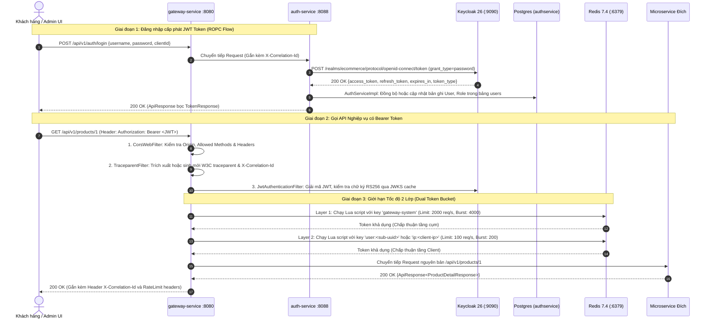
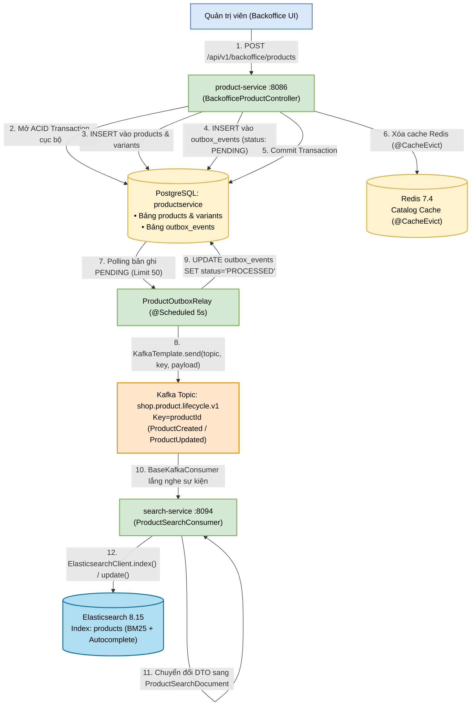
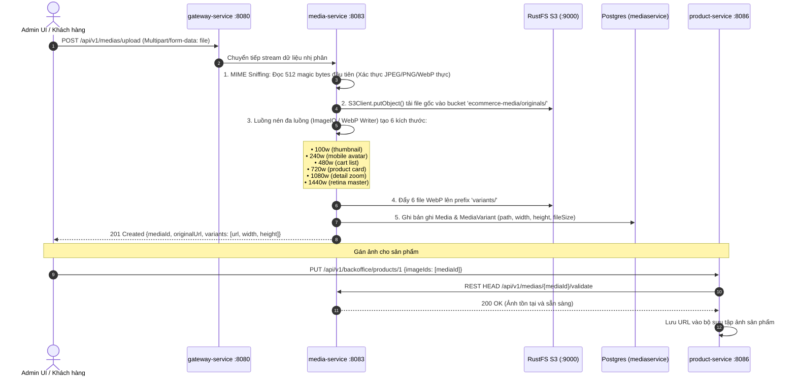
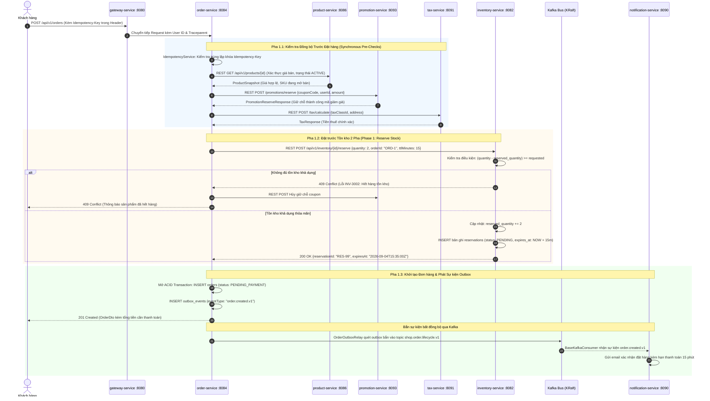
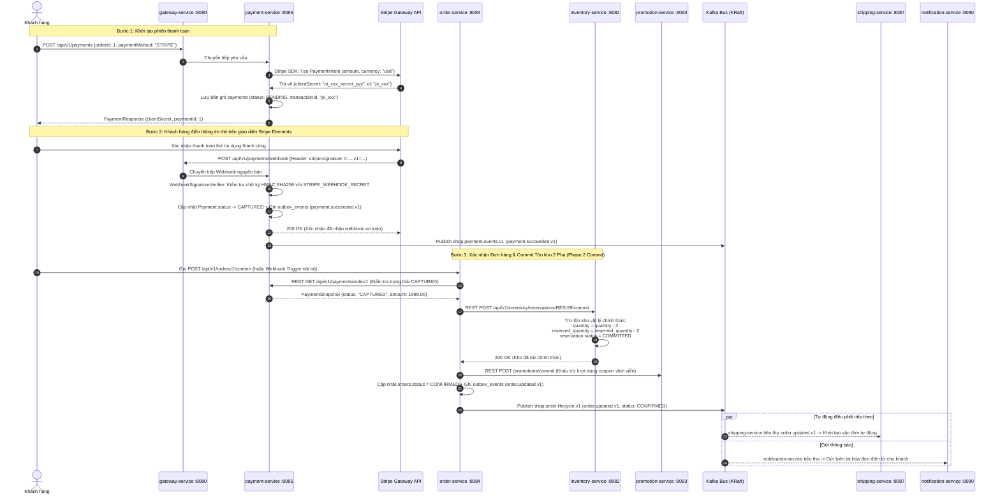
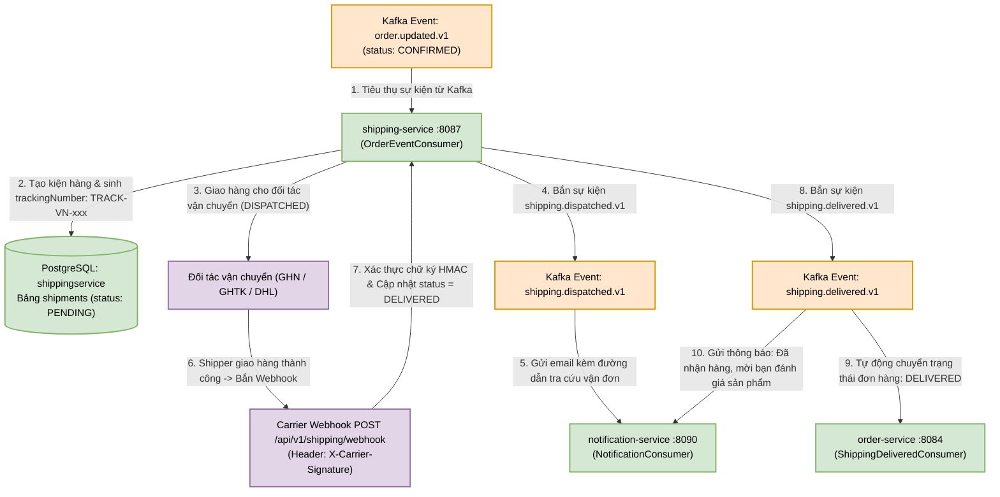
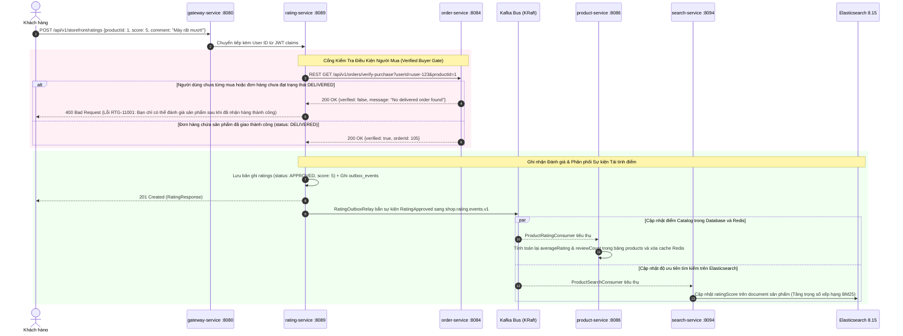
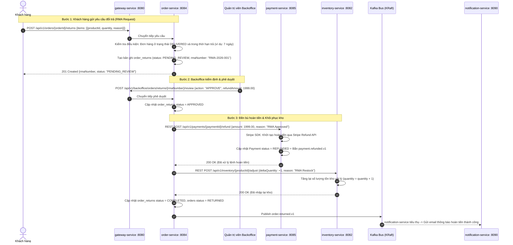

# 🏛️ Báo Cáo Phân Tích Kiến Trúc Toàn Diện Hệ Thống Microservices
## Petproject Microservices Platform — Enterprise E-Commerce

> **Báo cáo phân tích kiến trúc chuyên sâu hệ thống thương mại điện tử phân tán**  
> **Nền tảng công nghệ**: Java 25 (LTS) • Spring Boot 4.1.1 • Spring Cloud Gateway • Apache Kafka 3.9 (KRaft) • PostgreSQL 16 • Redis 7.4 • Elasticsearch 8.15 • Keycloak 26 • RustFS S3  
> **Công cụ trực quan hóa kiến trúc**: Archify Showcase Engine • Mermaid Vector Diagrams

---

## 📑 Mục lục Phân tích

1. [Tổng quan Hệ thống & Danh mục 14 Microservices + Hạ tầng](#1-tổng-quan-hệ-thống--danh-mục-14-microservices--hạ-tầng)
2. [Sơ đồ Kiến trúc Tổng thể Hệ thống (System Landscape Architecture)](#2-sơ-đồ-kiến-trúc-tổng-thể-hệ-thống-system-landscape-architecture)
3. [Phân tích Chi tiết 10 Luồng Nghiệp vụ Cốt lõi (Deep-Dive Execution Flows)](#3-phân-tích-chi-tiết-10-luồng-nghiệp-vụ-cốt-lõi-deep-dive-execution-flows)
   - [Luồng 1: Xác thực & Điều hướng Edge Gateway (Keycloak ROPC & Dual Rate Limiting)](#luồng-1-xác-thực--điều-hướng-edge-gateway-keycloak-ropc--dual-rate-limiting)
   - [Luồng 2: Quản lý Danh mục & Đồng bộ CDC Tìm kiếm (Transactional Outbox & Elasticsearch BM25)](#luồng-2-quản-lý-danh-mục--đồng-bộ-cdc-tìm-kiếm-transactional-outbox--elasticsearch-bm25)
   - [Luồng 3: Đường ống Xử lý Đa phương tiện & Tạo 6 Ảnh Responsive WebP (RustFS S3)](#luồng-3-đường-ống-xử-lý-đa-phương-tiện--tạo-6-ảnh-responsive-webp-rustfs-s3)
   - [Luồng 4: Trải nghiệm Khách hàng: Wishlist, Giỏ hàng & Bộ máy Tính giá Động](#luồng-4-trải-nghiệm-khách-hàng-wishlist-giỏ-hàng--bộ-máy-tính-giá-động)
   - [Luồng 5: Đặt hàng & Đặt trước Tồn kho 2 Pha (Order Checkout & Phase 1 Reservation Saga)](#luồng-5-đặt-hàng--đặt-trước-tồn-kho-2-pha-order-checkout--phase-1-reservation-saga)
   - [Luồng 6: Xử lý Thanh toán Đa Cổng & Xác nhận Đơn hàng (Stripe Webhook & Phase 2 Commit)](#luồng-6-xử-lý-thanh-toán-đa-cổng--xác-nhận-đơn-hàng-stripe-webhook--phase-2-commit)
   - [Luồng 7: Vận chuyển, Tích hợp Đối tác Logistics & Tự động Hoàn thành Đơn](#luồng-7-vận-chuyển-tích-hợp-đối-tác-logistics--tự-động-hoàn-thành-đơn)
   - [Luồng 8: Đánh giá Người mua Xác thực & Tái tính điểm Tìm kiếm (Eligibility Gate RTG-11001)](#luồng-8-đánh-giá-người-mua-xác-thực--tái-tính-điểm-tìm-kiếm-eligibility-gate-rtg-11001)
   - [Luồng 9: Quét Tồn kho Hết hạn, Hủy đơn & Đền bù Saga (Background Sweeper & Compensations)](#luồng-9-quét-tồn-kho-hết-hạn-hủy-đơn--đền-bù-saga-background-sweeper--compensations)
   - [Luồng 10: Quy trình Đổi trả Hàng Hóa Khép kín (RMA - Return Merchandise Authorization)](#luồng-10-quy-trình-đổi-trả-hàng-hóa-khép-kín-rma---return-merchandise-authorization)
4. [Hạ tầng Bắn Sự kiện & Bảng Ma trận Kafka Topics (Event-Driven Backbone)](#4-hạ-tầng-bắn-sự-kiện--bảng-ma-trận-kafka-topics-event-driven-backbone)
5. [Hạ tầng Lưu trữ Database-per-Service & Chiến lược Đảm bảo Chịu lỗi (Resilience)](#5-hạ-tầng-lưu-trữ-database-per-service--chiến-lược-đảm-bảo-chịu-lỗi-resilience)
6. [Báo cáo Kiểm định Archify Interactive Diagram](#6-báo-cáo-kiểm-định-archify-interactive-diagram)

---

## 1. Tổng quan Hệ thống & Danh mục 14 Microservices + Hạ tầng

Hệ thống **Petproject Microservices Platform** được tổ chức dưới dạng **Maven Reactor Multi-Module gồm 23 modules**:
- **14 Microservices độc lập** phục vụ từng nghiệp vụ chuyên biệt.
- **8 Thư viện dùng chung nền tảng (`utils/`)** chuẩn hóa Exception, Bảo mật, Kafka, Logging và Lưu trữ S3.
- **1 Root Aggregator POM**.

Toàn bộ các dịch vụ tuân thủ chặt chẽ mô hình **Database-per-Service**, không chia sẻ cơ sở dữ liệu vật lý và giao tiếp liên dịch vụ qua REST Client (kết hợp Resilience4j Circuit Breaker) cùng Apache Kafka KRaft.

### 📋 Bảng Danh mục 14 Microservices

| STT | Tên Dịch vụ | Cổng (Port) | Database Name | Trách nhiệm Cốt lõi (Domain Responsibilities) | Công nghệ Chính | Dependencies Liên Dịch vụ |
|:---:|---|:---:|---|---|---|---|
| 1 | **`gateway-service`** | `8080` | *Không dùng* (Redis) | Cửa ngõ API duy nhất, không cắt tiền tố `/api/v1/*`, xác thực JWT Keycloak, giới hạn tốc độ 2 tầng (Global 2000 req/s + Client 100 req/s), gán `X-Correlation-Id`. | Spring Cloud Gateway, Netty, Redis Lua, Resilience4j | Chuyển tiếp tới toàn bộ 13 services còn lại |
| 2 | **`auth-service`** | `8088` | `authservice` | Đăng nhập Keycloak ROPC, Refresh token, Đăng ký tài khoản, Đồng bộ người dùng cục bộ, Quản lý sổ địa chỉ giao hàng (`UserAddress`). | Spring Boot 4, Keycloak Admin Client, Spring Data JPA | Keycloak Admin REST API (:9090) |
| 3 | **`product-service`** | `8086` | `productservice` | Quản lý danh mục cây (tree taxonomy), thương hiệu, sản phẩm biến thể (SKU, thuộc tính), Redis Cache `@Cacheable`, Outbox Relay Kafka. | Spring Boot 4, Redis, PostgreSQL, Kafka Outbox | `media-service` (:8083) |
| 4 | **`inventory-service`** | `8082` | `inventoryservice` | Quản lý tồn kho kho hàng, Đặt trước tồn kho 2 pha (`/reserve`, `/commit`, `/release`), Sweeper tự động hoàn kho hết hạn. | Spring Boot 4, Scheduled Sweeper, Kafka Outbox | Độc lập (Nhận request từ `order-service`) |
| 5 | **`order-service`** | `8084` | `orderservice` | Quản lý giỏ hàng, Điều phối Choreography Saga đặt hàng, Idempotency key, RestClient bọc CircuitBreaker, Xử lý đổi trả RMA. | Spring Boot 4, Resilience4j, Kafka Outbox & Consumers | `product`, `inventory`, `promotion`, `tax`, `payment` |
| 6 | **`payment-service`** | `8085` | `paymentservice` | Tích hợp Stripe PaymentIntent, VNPay, MoMo, COD, Tiếp nhận webhook chữ ký HMAC Stripe, Quản lý trạng thái thanh toán, Hoàn tiền. | Spring Boot 4, Stripe SDK, Kafka Outbox | Stripe API, External Webhooks |
| 7 | **`shipping-service`** | `8087` | `shippingservice` | Tiếp nhận đơn xác nhận, Tạo vận đơn & tracking code, Tích hợp hãng vận chuyển (GHN, GHTK, DHL), Webhook cập nhật trạng thái giao. | Spring Boot 4, Carrier Adapters, Kafka Outbox | Kafka `shop.order.lifecycle.v1` |
| 8 | **`rating-service`** | `8089` | `ratingservice` | Đánh giá 1-5 sao kèm bình luận, Kiểm tra điều kiện người mua xác thực (Verified Buyer Gate `RTG-11001` qua `order-service`). | Spring Boot 4, RestClient, Kafka Outbox | `order-service` (:8084 `/verify-purchase`) |
| 9 | **`search-service`** | `8094` | *Elasticsearch* | Động cơ tìm kiếm BM25, Gợi ý từ khóa tự động (Edge n-gram Autocomplete), Lọc danh mục đa tiêu chí, Đồng bộ CDC thời gian thực. | Spring Boot 4, Elasticsearch 8.15 Java Client | `product-service` (:8086 reindex), Kafka |
| 10 | **`tax-service`** | `8091` | `taxservice` | Danh mục nhóm thuế (Tax Class), Tính toán thuế theo thời gian thực dựa trên phân loại sản phẩm và vị trí địa lý (Quốc gia, Bang, Zipcode). | Spring Boot 4, Spring Data JPA, PostgreSQL | Độc lập (Cung cấp API cho `order-service`) |
| 11 | **`promotion-service`**| `8093` | `promotionservice` | Quản lý chiến dịch khuyến mãi, mã giảm giá (% hoặc số tiền), điều kiện đơn tối thiểu, Giữ chỗ mã coupon (Reserve) và Khấu trừ (Commit). | Spring Boot 4, Spring Data JPA, PostgreSQL | Độc lập (Cung cấp API cho `order-service`) |
| 12 | **`favourite-service`**| `8081` | `favouriteservice` | Quản lý danh sách sản phẩm yêu thích (Wishlist) của khách hàng, Đánh dấu/bỏ đánh dấu, Phân trang danh sách lưu. | Spring Boot 4, Spring Data JPA, PostgreSQL | Độc lập (Tra cứu theo UserId từ JWT) |
| 13 | **`media-service`** | `8083` | `mediaservice` | Tải lên đa phương tiện, MIME sniffing đọc magic bytes chống giả mạo file, Tự động sản sinh 6 biến thể WebP responsive, Presigned S3 URLs. | Spring Boot 4, RustFS/S3 SDK, ImageIO WebP | `product-service` (Kiểm tra tham chiếu ảnh) |
| 14 | **`notification-service`**| `8090` | `notificationservice` | Trung tâm thông báo đa kênh (In-app Alerts, SMTP Email), Tự động gửi email xác nhận đặt hàng, biên lai thanh toán, cập nhật vận đơn. | Spring Boot 4, JavaMailSender, Kafka Consumers | Kafka Topics (Order, Payment, Shipping) |

---

### 🗄️ Bảng Danh mục 6 Thành phần Hạ tầng & Lưu trữ Phân tán

| Thành phần Hạ tầng | Công nghệ | Cổng Mạng (Ports) | Database / Index / Bucket | Mục đích Sử dụng |
|---|---|:---:|---|---|
| **Relational Database** | PostgreSQL 16 Alpine | `5432` | 12 Service DBs: `authservice`, `productservice`, `orderservice`, `inventoryservice`, `paymentservice`, `shippingservice`, `ratingservice`, `favouriteservice`, `taxservice`, `promotionservice`, `mediaservice`, `notificationservice` + `keycloak` | Lưu trữ dữ liệu nghiệp vụ quan hệ tuân thủ ACID cho từng microservice riêng biệt. Cấu hình `max_connections=300`. |
| **In-Memory Cache & Limiter** | Redis 7.4 Alpine | `6379` | `db: 0` (Key patterns: `request_rate_limiter.*`, `product::*`, `category::*`, `sso_session::*`) | Thực thi atomic Lua scripts phục vụ Rate Limiter 2 tầng tại Gateway; Cache danh mục và chi tiết sản phẩm (@Cacheable); Lưu phiên SSO. |
| **Distributed Event Bus** | Apache Kafka 3.9 | `9092` | Topics: `shop.order.lifecycle.v1`, `shop.product.lifecycle.v1`, `shop.inventory.events.v1`, `shop.payment.events.v1`, `shop.shipping.events.v1`, `shop.rating.events.v1`, `shop.media.lifecycle.v1` | Vận hành ở chế độ **KRaft** (không cần Zookeeper, `node_id=1`). Điều phối sự kiện bất đồng bộ, truyền tải Outbox CDC và đảm bảo thứ tự xử lý theo partition key. |
| **Full-Text Search Engine** | Elasticsearch 8.15 | `9200` | Indices: `products`, `ratings` | Động cơ tìm kiếm văn bản toàn văn thuật toán BM25, Autocomplete prefix suggester, bộ lọc giá và thuộc tính đa chiều. |
| **Identity & Access Management** | Keycloak 26 | `8080` (int) / `9090` (host) | Realm: `ecommerce` (Clients: `shop-client`, `gateway-client`, `admin-cli`) | Máy chủ xác thực tập trung OAuth2 / OpenID Connect, phát hành JWT token có chữ ký RS256, quản lý vai trò người dùng (`ROLE_CUSTOMER`, `ROLE_ADMIN`). |
| **Object Storage** | RustFS (S3 Compatible) | `9000` (API) / `9001` (Console) | Bucket: `ecommerce-media` (Prefixes: `originals/`, `variants/`) | Lưu trữ tệp tin tĩnh và hình ảnh sản phẩm với hiệu năng cao, cung cấp Presigned URL có thời hạn cho Client truy cập an toàn. |

---

### 📦 8 Thư viện Dùng chung Nền tảng (`utils/`)

1. **`common-core`**: Định dạng chuẩn `ApiResponse<T>` toàn hệ thống (`success`, `code`, `message`, `data`, `errors`, `path`, `traceId`, `timestamp`), danh mục mã lỗi `ErrorCode`, phân trang `PageResponse<T>`, ngoại lệ cơ sở `AppException`.
2. **`common-spring`**: Starter cấu hình sẵn Bean Validation, Exception Handler toàn cục, Swagger OpenAPI 3.1, Jackson Datetime ISO-8601, ModelMapper, Dotenv loader và Micrometer Prometheus metrics.
3. **`common-security`**: Cấu hình Spring Security 6 Resource Server, bộ chuyển đổi vai trò Keycloak Realm Roles (`ROLE_CUSTOMER`, `ROLE_ADMIN`), và tiện ích bảo mật `SecurityUtils`.
4. **`common-logging`**: Aspect lập hồ sơ hiệu năng thực thi `@LogExecutionTime`, trích xuất và lan truyền mã vết phân tán W3C `traceparent` và `X-Correlation-Id` qua MDC.
5. **`common-keycloak`**: Keycloak Admin Client abstraction, phục vụ đăng ký tài khoản người dùng, gán role và quản lý realm từ code Java.
6. **`common-kafka`**: Cấu hình Producer/Consumer chuẩn hóa, bọc `BaseKafkaConsumer` với cơ chế Dead-Letter Queue (DLQ), retry exponential backoff và bảo vệ tính lũy thoái (idempotency).
7. **`common-storage`**: SDK trừu tượng hóa thao tác với RustFS/S3 (Upload multipart, Delete, Head Object, sinh Presigned URL có thời hạn).
8. **`utils` (Aggregator)**: Module cha quản lý dependency BOM cho các module dùng chung.

---

## 2. Sơ đồ Kiến trúc Tổng thể Hệ thống (System Landscape Architecture)

Dưới đây là sơ đồ kiến trúc tổng thể toàn diện của hệ sinh thái **Petproject Microservices Platform**, thể hiện phân lớp rõ ràng từ tầng Client, Edge Gateway, Identity Tier, các Domain Services, Event Bus Kafka, các cơ sở dữ liệu riêng biệt và hệ thống đối tác bên ngoài:

```mermaid
%% Sơ đồ Kiến trúc Tổng thể Hệ thống — Petproject Microservices Platform
flowchart TB
    classDef clientClass fill:#dae8fc,stroke:#6c8ebf,stroke-width:2px,color:#000000;
    classDef gatewayClass fill:#ffe6cc,stroke:#d79b00,stroke-width:2px,color:#000000;
    classDef authClass fill:#e1d5e7,stroke:#9673a6,stroke-width:2px,color:#000000;
    classDef coreServiceClass fill:#d5e8d4,stroke:#82b366,stroke-width:2px,color:#000000;
    classDef cxServiceClass fill:#b1ddf0,stroke:#10739e,stroke-width:2px,color:#000000;
    classDef pricingServiceClass fill:#fad7ac,stroke:#b46504,stroke-width:2px,color:#000000;
    classDef fulfillServiceClass fill:#d0cee2,stroke:#56517e,stroke-width:2px,color:#000000;
    classDef busClass fill:#fff2cc,stroke:#d6b656,stroke-width:2px,color:#000000;
    classDef storeClass fill:#f5f5f5,stroke:#666666,stroke-width:2px,color:#000000;
    classDef extClass fill:#f8cecc,stroke:#b85450,stroke-width:2px,stroke-dasharray: 4 4,color:#000000;

    subgraph CLIENTS ["Lớp Khách hàng & Tác nhân Bên ngoài (Clients & Actors)"]
        WEB["Ứng dụng Web (React / Vue)"]:::clientClass
        MOBILE["Ứng dụng Di động (Flutter / React Native)"]:::clientClass
        ADMIN_UI["Trang Quản trị Backoffice UI"]:::clientClass
        STRIPE_EXT["Cổng Thanh toán Stripe (Stripe API)"]:::extClass
        CARRIER_EXT["Hãng Vận chuyển (GHN / GHTK / DHL)"]:::extClass
    end

    subgraph EDGE ["Lớp Cửa ngõ (Edge Gateway Tier)"]
        GW["gateway-service :8080<br/>• Dual Token Bucket Rate Limiting (Redis Lua)<br/>• OAuth2 JWT Signature Validation (Keycloak JWKS)<br/>• Distributed Tracing (X-Correlation-Id / MDC)<br/>• Định tuyến /api/v1/* không cắt tiền tố"]:::gatewayClass
    end

    subgraph IAM ["Lớp Định danh & Phân quyền (IAM Tier)"]
        KEYCLOAK["Keycloak 26 IAM (:9090)<br/>Realm: ecommerce<br/>Cấp phát Token RS256 / JWKS"]:::authClass
        AUTH_SVC["auth-service :8088<br/>ROPC Login, Token Refresh, Sổ địa chỉ, Mirror DB"]:::authClass
    end

    subgraph CORE_COMMERCE ["Miền Thương mại Cốt lõi (Core Commerce Domain)"]
        PRODUCT_SVC["product-service :8086<br/>Catalog, Danh mục cây, Biến thể SKU, Redis Cache"]:::coreServiceClass
        INV_SVC["inventory-service :8082<br/>2-Phase Stock Reservation, Sweeper hoàn kho"]:::coreServiceClass
        ORDER_SVC["order-service :8084<br/>Giỏ hàng, Điều phối Saga Đặt hàng, Xử lý RMA"]:::coreServiceClass
    end

    subgraph CUSTOMER_EXP ["Miền Trải nghiệm Khách hàng (Customer Experience Domain)"]
        SEARCH_SVC["search-service :8094<br/>Elasticsearch 8.15 BM25 & Edge n-gram Autocomplete"]:::cxServiceClass
        RATING_SVC["rating-service :8089<br/>Đánh giá sao & Cổng kiểm tra người mua RTG-11001"]:::cxServiceClass
        FAV_SVC["favourite-service :8081<br/>Danh sách yêu thích & Bookmark sản phẩm"]:::cxServiceClass
    end

    subgraph PRICING_MEDIA ["Miền Giá cả, Thuế & Đa phương tiện (Pricing & Media Domain)"]
        TAX_SVC["tax-service :8091<br/>Phân loại thuế & Bộ máy tính thuế theo địa lý"]:::pricingServiceClass
        PROMO_SVC["promotion-service :8093<br/>Chiến dịch, Mã coupon, Khấu trừ chiết khấu"]:::pricingServiceClass
        MEDIA_SVC["media-service :8083<br/>MIME Sniffing Magic Bytes & 6 Biến thể WebP"]:::pricingServiceClass
    end

    subgraph FULFILLMENT ["Miền Thực hiện Đơn & Truyền thông (Fulfillment Domain)"]
        PAY_SVC["payment-service :8085<br/>Stripe, VNPay, MoMo, COD, Webhook HMAC"]:::fulfillServiceClass
        SHIP_SVC["shipping-service :8087<br/>Tạo vận đơn, Tracking code, Webhook giao vận"]:::fulfillServiceClass
        NOTIF_SVC["notification-service :8090<br/>Thông báo In-app & Gửi Email SMTP tự động"]:::fulfillServiceClass
    end

    subgraph EVENT_BUS ["Xương sống Truyền tải Sự kiện (Event Streaming Backbone)"]
        KAFKA["Apache Kafka 3.9 (KRaft Cluster :9092)<br/>Topics: order.lifecycle, product.lifecycle, inventory.events,<br/>payment.events, shipping.events, rating.events, media.lifecycle"]:::busClass
    end

    subgraph PERSISTENCE ["Tầng Lưu trữ Bền vững (Database-per-Service Topology)"]
        PG[("PostgreSQL 16 (:5432)<br/>12 Database cô lập riêng biệt:<br/>authservice, productservice, orderservice, inventoryservice,<br/>paymentservice, shippingservice, ratingservice, favouriteservice,<br/>taxservice, promotionservice, mediaservice, notificationservice")]:::storeClass
        REDIS[("Redis 7.4 (:6379)<br/>Token Buckets, Caching sản phẩm, Phiên SSO")]:::storeClass
        ES[("Elasticsearch 8.15 (:9200)<br/>Chỉ mục Tìm kiếm products & ratings")]:::storeClass
        RUSTFS[("RustFS S3 (:9000)<br/>Bucket: ecommerce-media (Ảnh gốc + 6 WebP)")]:::storeClass
    end

    %% Wiring Clients to Gateway
    WEB & MOBILE & ADMIN_UI -->|"HTTP REST /api/v1/*"| GW
    STRIPE_EXT -->|"Webhook POST"| GW
    CARRIER_EXT -->|"Webhook POST"| GW

    %% Edge to Services
    GW -.->|"Xác thực Chữ ký JWT qua JWKS"| KEYCLOAK
    GW -->|"Atomic Lua Script Key Check"| REDIS
    GW --> AUTH_SVC & PRODUCT_SVC & INV_SVC & ORDER_SVC & SEARCH_SVC & RATING_SVC & FAV_SVC & TAX_SVC & PROMO_SVC & MEDIA_SVC & PAY_SVC & SHIP_SVC & NOTIF_SVC
    AUTH_SVC <-->|"Keycloak Admin REST API"| KEYCLOAK

    %% Synchronous Orchestration (RestClient bọc Resilience4j)
    ORDER_SVC -->|"REST GET /api/v1/products/{id}"| PRODUCT_SVC
    ORDER_SVC -->|"REST POST /reserve & /commit"| INV_SVC
    ORDER_SVC -->|"REST POST /promotions/apply"| PROMO_SVC
    ORDER_SVC -->|"REST POST /tax-rates/calculate"| TAX_SVC
    ORDER_SVC -->|"REST GET /payments/order/{id}"| PAY_SVC
    RATING_SVC -->|"REST GET /verify-purchase (RTG-11001)"| ORDER_SVC
    PRODUCT_SVC <-->|"REST Head / Validate Media"| MEDIA_SVC

    %% Asynchronous Outbox Event Publishing
    PRODUCT_SVC & INV_SVC & ORDER_SVC & PAY_SVC & SHIP_SVC & RATING_SVC & MEDIA_SVC -->|"Transactional Outbox Relay"| KAFKA

    %% Asynchronous Event Consumption
    KAFKA -->|"Đồng bộ CDC Sản phẩm / Đánh giá"| SEARCH_SVC
    KAFKA -->|"Tiêu thụ Order Confirmed -> Tạo vận đơn"| SHIP_SVC
    KAFKA -->|"Tiêu thụ Shipping Delivered -> Hoàn tất đơn"| ORDER_SVC
    KAFKA -->|"Tiêu thụ Rating Approved -> Tính lại sao"| PRODUCT_SVC
    KAFKA -->|"Tiêu thụ Sự kiện -> Gửi Email SMTP & In-app"| NOTIF_SVC

    %% Database Mappings
    AUTH_SVC & PRODUCT_SVC & INV_SVC & ORDER_SVC & PAY_SVC & SHIP_SVC & FAV_SVC & RATING_SVC & TAX_SVC & PROMO_SVC & MEDIA_SVC & NOTIF_SVC --> PG
    GW & PRODUCT_SVC <--> REDIS
    SEARCH_SVC <--> ES
    MEDIA_SVC <--> RUSTFS
```



---

## 3. Phân tích Chi tiết 10 Luồng Nghiệp vụ Cốt lõi (Deep-Dive Execution Flows)

Dưới đây là phân tích chi tiết đến từng class, method, tham số, dữ liệu lưu trữ và sơ đồ tuần tự cho toàn bộ 10 luồng tính năng quan trọng nhất trong mã nguồn:

---

### Luồng 1: Xác thực & Điều hướng Edge Gateway (Keycloak ROPC & Dual Rate Limiting)

Quá trình người dùng thực hiện đăng nhập, nhận JWT token và cơ chế an ninh 3 tầng tại API Gateway khi tiếp nhận bất kỳ request nào.



- **Endpoint**: `POST /api/v1/auth/login`
- **Request Body**: `LoginRequest { username: "customer1", password: "password123", clientId: "shop-client" }`
- **Xử lý nội bộ**:
  - `gateway-service` tiếp nhận, gán `X-Correlation-Id` vào MDC logging context.
  - `auth-service` (`AuthServiceImpl.login()`): Gọi HTTP POST sang Keycloak Token Endpoint `/realms/ecommerce/protocol/openid-connect/token`.
  - Trích xuất thông tin người dùng từ token claims (`sub`, `preferred_username`, `email`, `realm_access.roles`).
  - `UserRepository.findByUsername()`: Nếu chưa có thì khởi tạo bản ghi `User` mới (User Mirror Pattern) để phục vụ quan hệ dữ liệu nội bộ.
- **Dữ liệu lưu trữ**:
  - PostgreSQL `authservice`: Bảng `users` (lưu `id`, `username`, `email`, `first_name`, `last_name`), bảng `user_roles`.
- **Response**: `200 OK` bọc trong `ApiResponse<TokenResponse>` chứa `{ accessToken, refreshToken, expiresIn, tokenType: "Bearer" }`.

---

### Luồng 2: Quản lý Danh mục & Đồng bộ CDC Tìm kiếm (Transactional Outbox & Elasticsearch BM25)

Khi Quản trị viên cập nhật danh mục hoặc sản phẩm, hệ thống cam kết dữ liệu PostgreSQL và sự kiện Kafka nhất quán 100% nhờ **Transactional Outbox Pattern**, từ đó `search-service` tự động cập nhật Elasticsearch.



- **Endpoint**: `POST /api/v1/backoffice/products` (Header `Authorization: Bearer <ADMIN_JWT>`)
- **Request Body**: `ProductCreateRequest { name: "MacBook Pro M4", slug: "macbook-pro-m4", price: 1999.00, categoryId: 5, brandId: 2, variants: [...] }`
- **Xử lý nội bộ**:
  - `ProductServiceImpl.createProduct()`: Mở Transaction Spring `@Transactional`.
  - Validate tính hợp lệ của `categoryId`, `brandId`.
  - Lưu vào bảng `products` và danh sách `product_variants`.
  - `TransactionalProductEventPublisher`: Tạo đối tượng `OutboxEvent` với `aggregateType="PRODUCT"`, `eventType="ProductCreated"`, `payload=JSON` và lưu vào bảng `outbox_events` trong **cùng transaction ACID**.
  - Xóa cache `@CacheEvict(value = "products", allEntries = true)`.
  - `ProductOutboxRelay` (chạy nền `@Scheduled(fixedDelay = 5000)`): Quét các bản ghi `PENDING`, publish vào Kafka `shop.product.lifecycle.v1` với `PartitionKey=productId`.
  - `search-service` (`ProductSearchConsumer`): Nhận message, xây dựng `ProductSearchDocument` gồm title, description, categoryName, brandName, price, ratingScore, tag list và đẩy vào Elasticsearch qua `ElasticsearchClient`.
- **Dữ liệu lưu trữ**:
  - DB `productservice`: Bảng `products`, `product_variants`, `outbox_events`.
  - DB `search-service`: Elasticsearch index `products`.
- **Response**: `201 Created` bọc `ProductDetailResponse`.

---

### Luồng 3: Đường ống Xử lý Đa phương tiện & Tạo 6 Ảnh Responsive WebP (RustFS S3)

Bảo vệ an ninh tập tin tải lên thông qua **MIME Type Sniffing** (đọc magic bytes đầu file, ngăn chặn việc đổi đuôi file `.exe` hay `.php` thành `.jpg`), tự động resize và nén sang chuẩn WebP 6 độ phân giải.



- **Endpoint**: `POST /api/v1/medias/upload`
- **Payload**: Multipart form file binary (`image/jpeg`, `image/png`).
- **Xử lý nội bộ**:
  - `MediaServiceImpl.uploadMedia()`:
  - Dùng `Apache Tika` / Magic Bytes detector đọc byte header để xác định MIME thật sự (loại bỏ file giả mạo).
  - Tải file gốc lên RustFS S3 qua AWS S3 SDK v2 (`PutObjectRequest`).
  - Kích hoạt pipeline xử lý ảnh tạo 6 biến thể: `100w`, `240w`, `480w`, `720w`, `1080w`, `1440w` với định dạng tối ưu WebP chất lượng 85%.
  - Tạo Presigned URL có thời hạn (TTL 1 giờ) hoặc Public CDN URL.
- **Dữ liệu lưu trữ**:
  - S3 `ecommerce-media`: `originals/<uuid>.jpg`, `variants/<uuid>_720w.webp`, v.v.
  - PostgreSQL `mediaservice`: Bảng `medias` và `media_variants`.
- **Response**: `201 Created` bọc danh sách URLs của các variants.

---

### Luồng 4: Trải nghiệm Khách hàng: Wishlist, Giỏ hàng & Bộ máy Tính giá Động

Quy trình khách hàng quản lý danh sách yêu thích, thêm sản phẩm vào giỏ hàng và hệ thống tự động bóc tách chi phí (Pricing Breakdown) gồm tính chiết khấu khuyến mãi và thuế địa lý theo thời gian thực.

```mermaid
flowchart LR
    classDef client fill:#dae8fc,stroke:#6c8ebf,stroke-width:2px,color:#000000;
    classDef gateway fill:#ffe6cc,stroke:#d79b00,stroke-width:2px,color:#000000;
    classDef service fill:#d5e8d4,stroke:#82b366,stroke-width:2px,color:#000000;

    USER["Khách hàng"]:::client
    GW["gateway-service :8080"]:::gateway
    FAV["favourite-service :8081<br/>Wishlist & Bookmarks"]:::service
    CART["order-service :8084<br/>(CartServiceImpl & PricingServiceImpl)"]:::service
    PROMO["promotion-service :8093<br/>(PromotionReservationController)"]:::service
    TAX["tax-service :8091<br/>(TaxCalculationController)"]:::service

    USER -->|"1. POST /api/v1/favourites/{productId}"| GW --> FAV
    USER -->|"2. POST /api/v1/cart/items"| GW --> CART
    CART -->|"3. REST POST /promotions/apply {code, subtotal}"| PROMO
    PROMO -->>|"4. Trả về mức giảm: -10% (-$50)"| CART
    CART -->|"5. REST POST /tax-rates/calculate {classId, country}"| TAX
    TAX -->>|"6. Trả về tiền thuế: VAT 10% (+$45)"| CART
    CART -->>|"7. Pricing Breakdown: Subtotal $500 - Promo $50 + Tax $45 = Total $495"| USER
```

- **Endpoints**:
  - Thêm yêu thích: `POST /api/v1/favourites/{productId}`
  - Thêm giỏ hàng: `POST /api/v1/cart/items` `{ productId, quantity: 2, variantId: 10 }`
  - Áp dụng coupon tính giá: `POST /api/v1/cart/apply-coupon` `{ couponCode: "SALE2026" }`
- **Xử lý nội bộ**:
  - `order-service` (`CartServiceImpl`): Tìm giỏ hàng theo `userId` (hoặc `guestSessionId`). Cập nhật bảng `carts` và `cart_items`.
  - `PricingServiceImpl.calculatePricing()`:
    - Gọi REST sang `promotion-service` (`/api/v1/backoffice/promotions/apply`): Kiểm tra hạn dùng, lượt dùng còn lại, giá trị đơn tối thiểu. Tính số tiền giảm `discountAmount`.
    - Gọi REST sang `tax-service` (`/api/v1/tax/calculate`): Dựa trên mã quốc gia/bang của địa chỉ giao hàng và `taxClassId` của sản phẩm để tính chính xác `taxAmount`.
    - Công thức chốt giá: $	ext{Total} = 	ext{Subtotal} - 	ext{Discount} + 	ext{Tax} + 	ext{ShippingFee}$.
- **Dữ liệu lưu trữ**: DB `orderservice`: Bảng `carts`, `cart_items`. DB `favouriteservice`: Bảng `favourites`.
- **Response**: `200 OK` chứa chi tiết giỏ hàng và bảng kê giá `PricingBreakdown`.

---

### Luồng 5: Đặt hàng & Đặt trước Tồn kho 2 Pha (Order Checkout & Phase 1 Reservation Saga)

Đây là quy trình tối quan trọng trong thương mại điện tử. Hệ thống áp dụng **2-Phase Stock Reservation** để đảm bảo **tuyệt đối không bao giờ xảy ra tình trạng bán vượt tồn kho (overselling)** khi nhiều khách hàng cùng thanh toán đồng thời.



- **Endpoint**: `POST /api/v1/orders`
- **Headers**: `Authorization: Bearer <JWT>`, `Idempotency-Key: <UUID>`
- **Request Body**:
  ```json
  {
    "items": [{ "productId": 1, "variantId": 10, "quantity": 2, "price": 999.00 }],
    "shippingAddress": { "street": "123 Le Loi", "city": "HCM", "country": "VN" },
    "couponCode": "DISCOUNT50",
    "paymentMethod": "STRIPE"
  }
  ```
- **Xử lý nội bộ**:
  - `OrderCreateSaga.execute()` điều phối:
  - B1: Kiểm tra khóa `Idempotency-Key` trong bảng `idempotency_keys` (ngăn chặn double-charge khi người dùng double-click).
  - B2: Gọi REST xác thực sản phẩm từ `product-service` và tính giá chiết khấu/thuế.
  - B3: Gọi REST sang `inventory-service` (`/api/v1/inventory/{productId}/reserve`).
  - Tại `inventory-service`: Truy vấn `SELECT ... FOR UPDATE` bản ghi `inventory`. Kiểm tra `(quantity - reserved_quantity) >= requested`. Tăng `reserved_quantity`, tạo bản ghi trong bảng `reservations` với trạng thái `PENDING` và TTL 15 phút.
  - B4: Lưu đơn hàng vào bảng `orders` với trạng thái `PENDING_PAYMENT`.
  - B5: Lưu sự kiện `order.created.v1` vào bảng `outbox_events`.
- **Dữ liệu lưu trữ**:
  - DB `orderservice`: Bảng `orders`, `order_items`, `idempotency_keys`, `outbox_events`.
  - DB `inventoryservice`: Cập nhật cột `reserved_quantity` trong `inventory`, thêm bản ghi `reservations`.
- **Response**: `201 Created` chứa `OrderResponse { id, orderNumber, totalAmount, status: "PENDING_PAYMENT", expiresAt }`.

---

### Luồng 6: Xử lý Thanh toán Đa Cổng & Xác nhận Đơn hàng (Stripe Webhook & Phase 2 Commit)

Khách hàng thực hiện thanh toán qua Stripe. Khi Stripe gửi Webhook xác nhận giao dịch thành công (kèm chữ ký HMAC), hệ thống chuyển đổi trạng thái thanh toán và kích hoạt **Phase 2 Commit** để trừ tồn kho vật lý vĩnh viễn.



- **Endpoint**: Khởi tạo: `POST /api/v1/payments` • Webhook: `POST /api/v1/payments/webhook`
- **Request Body Khởi tạo**: `{ "orderId": 1, "paymentMethod": "STRIPE" }`
- **Xử lý nội bộ**:
  - `PaymentServiceImpl.createPayment()`: Sử dụng `PaymentProviderFactory` lấy ra `StripeProvider`. Gọi `com.stripe.model.PaymentIntent.create()`.
  - Tại Webhook: `WebhookSignatureVerifier` băm nội dung bằng HMAC SHA256 so khớp với header `stripe-signature` (chặn đứng tấn công giả mạo thanh toán `PAY-5005`).
  - Cập nhật trạng thái `Payment` thành `CAPTURED`.
  - `OrderCommitCoordinator.confirmOrder()`:
    - Kiểm tra trạng thái thanh toán từ `payment-service`.
    - Gọi Phase 2 Commit sang `inventory-service`: Trừ vĩnh viễn `quantity = quantity - count`, giải phóng `reserved_quantity = reserved_quantity - count`, chuyển `reservation` sang `COMMITTED`.
    - Chuyển `Order` sang `CONFIRMED`.
    - Bắn sự kiện `order.updated.v1` sang Kafka topic `shop.order.lifecycle.v1`.
- **Dữ liệu lưu trữ**:
  - DB `paymentservice`: Bảng `payments` (cập nhật `CAPTURED`, `captured_at`), `payment_events`, `outbox_events`.
  - DB `inventoryservice`: Cập nhật `quantity` thực tế trong `inventory`, cập nhật `reservations`.
  - DB `orderservice`: Bảng `orders` chuyển `status = CONFIRMED`.
- **Response**: `200 OK` cho Webhook; `200 OK` chứa `OrderResponse { status: "CONFIRMED" }`.

---

### Luồng 7: Vận chuyển, Tích hợp Đối tác Logistics & Tự động Hoàn thành Đơn

Từ khi đơn hàng được xác nhận, `shipping-service` tự động tiếp nhận kiện hàng, sinh mã vận đơn tracking và lắng nghe webhook hành trình của đối tác giao vận để tự động hoàn thành đơn khi giao thành công.



- **Sự kiện kích hoạt**: Kafka event `order.updated.v1` với `status: "CONFIRMED"` trên topic `shop.order.lifecycle.v1`.
- **Xử lý nội bộ**:
  - `shipping-service` (`OrderEventConsumer`): Nhận sự kiện, khởi tạo bản ghi `Shipment` với mã `trackingNumber` dạng `TRACK-<UUID>`, trạng thái `PENDING`.
  - Chọn `CarrierAdapter` (GHN, GHTK, DHL) để gửi thông tin kiện hàng sang API của đối tác giao vận.
  - Khi bưu tá lấy hàng: Cập nhật `ShipmentStatus = DISPATCHED`, bắn sự kiện `shipping.dispatched.v1`.
  - Tiếp nhận Webhook đối tác: `CarrierWebhookController` xác thực chữ ký `X-Carrier-Signature`. Khi trạng thái đối tác báo thành công, chuyển `ShipmentStatus = DELIVERED`, ghi outbox và bắn sự kiện `shipping.delivered.v1`.
  - `order-service` (`ShippingDeliveredConsumer`): Tiêu thụ `shipping.delivered.v1`, tự động chuyển trạng thái `Order` từ `SHIPPED` sang `DELIVERED` (đóng đơn hàng tự động mà không cần can thiệp thủ công).
- **Dữ liệu lưu trữ**:
  - DB `shippingservice`: Bảng `shipments` (lưu `orderId`, `carrier`, `trackingNumber`, `status: DELIVERED`).
  - DB `orderservice`: Bảng `orders` (chuyển `status = DELIVERED`, `delivered_at = NOW()`).
- **Response**: Webhook phản hồi `200 OK` cho hãng vận chuyển.

---

### Luồng 8: Đánh giá Người mua Xác thực & Tái tính điểm Tìm kiếm (Eligibility Gate RTG-11001)

Chống triệt để việc spam đánh giá ảo hoặc cạnh tranh không lành mạnh bằng **Cổng Kiểm Tra Điều Kiện Người Mua (Verified Buyer Gate)**. Chỉ người thực sự mua và đã nhận hàng (`status: DELIVERED`) mới có quyền đánh giá.



- **Endpoint**: `POST /api/v1/storefront/ratings`
- **Request Body**: `{ "productId": 1, "score": 5, "comment": "Chất lượng vượt mong đợi!" }`
- **Xử lý nội bộ**:
  - `rating-service` (`StorefrontRatingController`): Lấy `userId` từ Security Context.
  - `EligibilityClient`: Gọi REST đồng bộ sang `order-service` (`/api/v1/orders/verify-purchase?userId=...&productId=...`).
  - `order-service` truy vấn: Tìm kiếm đơn hàng của `userId` có chứa `productId` này và có `OrderStatus == DELIVERED`. Nếu không thỏa mãn, trả về `verified: false`.
  - `rating-service` chặn đứng và ném lỗi `AppException(ErrorCode.RATING_BUYER_NOT_ELIGIBLE, "RTG-11001")`.
  - Nếu thỏa mãn: Lưu đánh giá vào bảng `ratings` với trạng thái `APPROVED`, ghi outbox.
  - `RatingOutboxRelay` publish `RatingApproved` vào Kafka `shop.rating.events.v1`.
  - `product-service` cập nhật lại điểm trung bình cộng số sao và tổng lượt review trong cơ sở dữ liệu và làm mới Redis.
  - `search-service` cập nhật trường `ratingScore` trong tài liệu Elasticsearch, giúp sản phẩm có điểm cao xuất hiện trên đầu kết quả tìm kiếm.
- **Dữ liệu lưu trữ**:
  - DB `ratingservice`: Bảng `ratings`.
  - DB `productservice`: Cột `average_rating`, `review_count` trong bảng `products`.
  - Elasticsearch: Update trường `ratingScore` trong index `products`.
- **Response**: `201 Created` bọc `RatingResponse`.

---

### Luồng 9: Quét Tồn kho Hết hạn, Hủy đơn & Đền bù Saga (Background Sweeper & Compensations)

Cơ chế tự bảo vệ và đảm bảo **tính nhất quán cuối cùng (Eventual Consistency)** khi gặp sự cố người dùng bỏ dở phiên thanh toán, hủy đơn hoặc lỗi mạng.

```mermaid
flowchart TD
    classDef timerClass fill:#ffe6cc,stroke:#d79b00,stroke-width:2px,color:#000000;
    classDef serviceClass fill:#d5e8d4,stroke:#82b366,stroke-width:2px,color:#000000;
    classDef dbClass fill:#fff2cc,stroke:#d6b656,stroke-width:2px,color:#000000;

    subgraph SWEEPER_FLOW ["Bộ quét Tự động Nhả Tồn kho Hết hạn (Inventory Sweeper Job)"]
        TIMER["ReservationCleanupScheduler<br/>@Scheduled(fixedDelay = 60000) định kỳ 1 phút"]:::timerClass
        SWEEPER["ReservationServiceImpl.releaseExpiredReservations()"]:::serviceClass
        INV_DB[("PostgreSQL: inventoryservice<br/>SELECT * FROM reservations<br/>WHERE status='PENDING' AND expires_at < NOW()")]:::dbClass
        RESTORE[("Khôi phục Tồn kho Khả dụng:<br/>reserved_quantity = reserved_quantity - quantity<br/>status = 'EXPIRED'")]:::dbClass
        INV_EVT["Bắn sự kiện Kafka: inventory.released.v1"]:::timerClass

        TIMER --> SWEEPER
        SWEEPER --> INV_DB
        INV_DB -->|"Tìm thấy các phiên giữ chỗ quá 15 phút chưa thanh toán"| RESTORE
        RESTORE --> INV_EVT
    end

    subgraph CANCEL_FLOW ["Quy trình Hủy đơn & Đền bù Saga (Order Cancellation Saga Compensation)"]
        CANCEL_REQ["Khách hàng hủy đơn / Quá hạn thanh toán"]:::timerClass
        ORD_SVC["order-service :8084<br/>(OrderStatusServiceImpl)"]:::serviceClass
        REL_INV["Gọi REST POST /inventory/reservations/{id}/release"]:::serviceClass
        REL_PROMO["Gọi REST POST /promotions/release"]:::serviceClass
        ORD_EVT["Bắn sự kiện Kafka: order.cancelled.v1"]:::timerClass

        CANCEL_REQ --> ORD_SVC
        ORD_SVC -->|"1. Cập nhật status = CANCELLED"| ORD_SVC
        ORD_SVC -->|"2. Giải phóng số lượng giữ chỗ kho"| REL_INV
        ORD_SVC -->|"3. Hoàn trả lại mã coupon cho khách"| REL_PROMO
        ORD_SVC -->|"4. Thông báo hủy đơn qua Kafka"| ORD_EVT
    end
```



- **Thành phần quét nền**: `ReservationCleanupScheduler` trong `inventory-service` (chạy mỗi 60 giây).
- **Xử lý nội bộ**:
  - Quét các bản ghi trong bảng `reservations` có `status == 'PENDING'` và `expires_at < LocalDateTime.now()`.
  - Với mỗi bản ghi: Giảm `reserved_quantity` tương ứng trong bảng `inventory`, cập nhật trạng thái giữ chỗ thành `EXPIRED`.
  - Bắn sự kiện `inventory.released.v1` để các hệ thống khác cập nhật số lượng tồn kho khả dụng.
  - Đối với trường hợp hủy đơn chủ động: `order-service` gọi đền bù (Compensation) sang `inventory-service` để giải phóng giữ chỗ ngay lập tức và gọi `promotion-service` để hoàn lại lượt sử dụng mã khuyến mãi.

---

### Luồng 10: Quy trình Đổi trả Hàng Hóa Khép kín (RMA - Return Merchandise Authorization)

Quy trình quản lý hậu mãi (Post-Purchase RMA) từ khi khách hàng gửi yêu cầu trả hàng, quản trị viên duyệt đơn, hoàn tiền tự động và tái nhập hàng vào kho.



- **Endpoints**:
  - Khách hàng tạo yêu cầu: `POST /api/v1/orders/{orderId}/returns`
  - Admin duyệt/từ chối: `POST /api/v1/backoffice/orders/returns/{rmaNumber}/review`
- **Request Body**:
  ```json
  {
    "reason": "Sản phẩm bị lỗi cổng sạc",
    "items": [{ "orderItemId": 12, "quantity": 1 }]
  }
  ```
- **Xử lý nội bộ**:
  - `OrderReturnServiceImpl.createReturn()`: Kiểm tra trạng thái đơn phải là `DELIVERED`.
  - Sinh mã RMA độc nhất `RMA-<NĂM>-<UUID>`.
  - Khi Quản trị viên duyệt: Gọi đồng bộ sang `payment-service` (`/api/v1/payments/{id}/refund`) để hoàn tiền qua cổng thanh toán ban đầu (Stripe Refund API).
  - Gọi sang `inventory-service` điều chỉnh lại tồn kho thực tế (`quantity += returned_quantity`).
  - Cập nhật trạng thái `OrderReturn` thành `COMPLETED` và `Order` thành `RETURNED`.
- **Dữ liệu lưu trữ**: DB `orderservice`: Bảng `order_returns`, cập nhật bảng `orders`. DB `paymentservice`: Bảng `refunds`. DB `inventoryservice`: Tăng tồn kho bảng `inventory`.
- **Response**: `200 OK` chứa chi tiết phiếu trả hàng và biên lai hoàn tiền.

---

## 4. Hạ tầng Bắn Sự kiện & Bảng Ma trận Kafka Topics (Event-Driven Backbone)

Hệ thống sử dụng cụm **Apache Kafka 3.9 vận hành ở chế độ KRaft** làm xương sống truyền thông điệp bất đồng bộ. Toàn bộ các sự kiện thay đổi trạng thái đều được phát sinh từ bảng `outbox_events` của từng dịch vụ để đảm bảo độ tin cậy tuyệt đối (At-Least-Once Delivery).

### 📊 Bảng Ma trận Ánh xạ Kafka Topics, Producers & Consumers

| Kafka Topic | Dịch vụ Sản sinh (Producer) | Partition Key | Tên Sự kiện (Event Types) & Ý nghĩa | Dịch vụ Tiêu thụ (Consumers) & Hành động Nghiệp vụ |
|---|---|---|---|---|
| **`shop.order.lifecycle.v1`** | `order-service` | `orderId` | • `order.created.v1`: Khách vừa tạo đơn.<br/>• `order.updated.v1`: Đơn chuyển sang `CONFIRMED`.<br/>• `order.cancelled.v1`: Đơn bị hủy.<br/>• `order.returned.v1`: Hoàn trả hàng thành công. | • **`shipping-service`**: Nhận `order.updated.v1` (CONFIRMED) $
ightarrow$ Tự động tạo vận đơn & mã tracking.<br/>• **`notification-service`**: Gửi email xác nhận đặt hàng, thông báo hủy đơn hoặc hướng dẫn đổi trả. |
| **`shop.product.lifecycle.v1`** | `product-service` | `productId` | • `ProductCreated`: Thêm sản phẩm mới.<br/>• `ProductUpdated`: Thay đổi giá, mô tả, SKU.<br/>• `ProductDeleted`: Xóa sản phẩm khỏi catalog. | • **`search-service`**: Tiêu thụ sự kiện để Upsert / Delete tài liệu sản phẩm trên Elasticsearch index `products`. |
| **`shop.inventory.events.v1`** | `inventory-service` | `productId` | • `inventory.reserved.v1`: Đặt trước kho thành công.<br/>• `inventory.committed.v1`: Trừ kho vật lý vĩnh viễn.<br/>• `inventory.released.v1`: Hết hạn / Hủy đơn, nhả kho.<br/>• `inventory.adjusted.v1`: Nhập hàng hoặc kiểm kê. | • **`order-service`**: Giám sát biến động tồn kho theo thời gian thực.<br/>• **Kiểm toán & Báo cáo**: Ghi nhận lịch sử luân chuyển kho hàng. |
| **`shop.payment.events.v1`** | `payment-service` | `orderId` | • `payment.succeeded.v1`: Thanh toán thành công (Stripe / VNPay / MoMo).<br/>• `payment.failed.v1`: Thẻ bị từ chối / Lỗi giao dịch.<br/>• `payment.refunded.v1`: Hoàn tiền thành công. | • **`order-service`**: Nhận tín hiệu để sẵn sàng xác nhận đơn hàng.<br/>• **`notification-service`**: Gửi biên lai hóa đơn thanh toán hoặc thông báo lỗi giao dịch. |
| **`shop.shipping.events.v1`** | `shipping-service` | `orderId` | • `shipping.dispatched.v1`: Đã bàn giao shipper.<br/>• `shipping.delivered.v1`: Giao hàng thành công đến tay khách. | • **`order-service`**: Nhận `shipping.delivered.v1` $
ightarrow$ Tự động chuyển trạng thái đơn sang `DELIVERED`.<br/>• **`notification-service`**: Gửi email thông báo mã vận đơn hoặc mời khách đánh giá. |
| **`shop.rating.events.v1`** | `rating-service` | `productId` | • `RatingCreated`: Khách gửi đánh giá mới.<br/>• `RatingApproved`: Đánh giá được duyệt hiển thị.<br/>• `RatingRejected`: Đánh giá vi phạm tiêu chuẩn. | • **`product-service`**: Tính lại điểm trung bình cộng số sao và tổng số lượt đánh giá trong DB & Redis.<br/>• **`search-service`**: Cập nhật điểm uy tín `ratingScore` vào Elasticsearch index `products`. |
| **`shop.media.lifecycle.v1`** | `media-service` | `mediaId` | • `MediaDeleted`: Tệp tin đa phương tiện bị xóa. | • **`product-service`**: Dọn dẹp các liên kết ảnh chết trong bộ sưu tập gallery của sản phẩm. |

---

## 5. Hạ tầng Lưu trữ Database-per-Service & Chiến lược Đảm bảo Chịu lỗi (Resilience)

### 1. Kiến trúc Database-per-Service
Hệ thống loại bỏ hoàn toàn việc join bảng xuyên dịch vụ:
- Mỗi dịch vụ sở hữu chuỗi kết nối riêng biệt đến một database logic độc lập trên PostgreSQL 16 (ví dụ: `jdbc:postgresql://postgres:5432/orderservice`).
- Mọi quan hệ giữa các thực thể khác miền đều được lưu dưới dạng ID tham chiếu (Weak Reference ID) như `productId`, `userId`, `orderId`.
- Dữ liệu lịch sử (snapshot) như giá sản phẩm tại thời điểm mua, tên sản phẩm, địa chỉ giao hàng được denormalize lưu trực tiếp vào bảng `order_items` và `orders` để đảm bảo đơn hàng không bị thay đổi ngay cả khi sản phẩm gốc đổi giá hay bị xóa.

### 2. Hai tầng Giới hạn Tốc độ (Two-Layer Token Bucket) tại Gateway
- **Tầng 1 (Global System Limiter)**: Bảo vệ hạ tầng không bị quá tải trong các chiến dịch Flash Sale. Giới hạn toàn hệ thống ở mức **2.000 req/s** (Burst: **4.000 req**). Thực thi qua Redis Lua Script độc lập.
- **Tầng 2 (Per-Client Per-Route Limiter)**: Ngăn chặn scraping, spam request hoặc tấn công từ chối dịch vụ từ một IP hoặc một tài khoản cụ thể. Giới hạn **100 req/s** (Burst: **200 req**).
- Khi vượt ngưỡng: Gateway phản hồi ngay lập tức mã lỗi **HTTP 429 Too Many Requests** mà không để request đi sâu vào cụm backend.

### 3. Circuit Breaker & Fallback với Resilience4j
- Toàn bộ các giao tiếp HTTP đồng bộ từ `order-service` sang `product-service`, `tax-service`, `promotion-service`, `inventory-service` đều được bọc bởi **Resilience4j CircuitBreaker**:
  - Trạng thái `CLOSED`: Mọi request đi qua bình thường.
  - Trạng thái `OPEN`: Khi tỷ lệ lỗi vượt quá 50% trong sliding window 10 requests, ngắt mạch ngay lập tức, trả về fallback response mà không chờ timeout.
  - Trạng thái `HALF_OPEN`: Thử nghiệm cho 3 requests đi qua sau 5 giây để kiểm tra sự phục hồi của downstream service.

### 4. Idempotency & Dead Letter Queue (DLQ)
- Tất cả các API thay đổi trạng thái nhạy cảm (tạo đơn, thanh toán) đều yêu cầu client gửi header `Idempotency-Key`.
- Lớp `common-kafka` trang bị cho các consumers cơ chế retry với Exponential Backoff (3 lần). Nếu quá số lần thử lại, message tự động được chuyển tiếp vào Dead-Letter Queue Topic (`<topic>.DLT`) để kỹ sư vận hành kiểm tra và xử lý mà không làm nghẽn luồng xử lý chính.

---


## 7. Bộ Sưu Tập Sơ Đồ Tương Tác Archify (Interactive Showcase Diagrams)

Hệ thống đã biên dịch và bàn giao trọn bộ 3 sơ đồ tương tác độc lập (Standalone HTML với SVG nhúng, Dark/Light Theme, Pan/Zoom và Export) theo tiêu chuẩn chất lượng cao nhất **Showcase Quality Profile (9/9 checks passed, 0 errors, 0 warnings)**:

| Tên Sơ Đồ Archify | Loại Sơ Đồ | File Đặc Tả JSON | File HTML Độc Lập | Điểm Nổi Bật |
|---|:---:|---|---|---|
| **1. System Landscape Architecture** | `architecture` | [petproject-platform.architecture.json](file:///home/tonminh/Documents/petproject/docs/architecture/petproject-platform.architecture.json) | [petproject-platform.html](file:///home/tonminh/Documents/petproject/docs/architecture/petproject-platform.html) | Toàn cảnh phân tầng Client, Gateway, Core, Fulfillment, DBs, Kafka |
| **2. E2E Order SAGA & 2-Phase Stock** | `sequence` | [order-fulfillment-saga.sequence.json](file:///home/tonminh/Documents/petproject/docs/architecture/order-fulfillment-saga.sequence.json) | [order-fulfillment-saga.html](file:///home/tonminh/Documents/petproject/docs/architecture/order-fulfillment-saga.html) | Chi tiết 17 bước SAGA: Pre-checks, Reserve 15m, Stripe HMAC, Commit kho song song |
| **3. Transactional Outbox & Event Relay** | `workflow` (v2) | [transactional-outbox.workflow.json](file:///home/tonminh/Documents/petproject/docs/architecture/transactional-outbox.workflow.json) | [transactional-outbox.html](file:///home/tonminh/Documents/petproject/docs/architecture/transactional-outbox.html) | Quy trình kép ACID TX, SKIP LOCKED, Kafka Publish, Consumer Idempotency & DLQ |

## 6. Báo cáo Kiểm định Archify Interactive Diagram

Dựa trên yêu cầu của bạn về việc ứng dụng kỹ năng **Archify**, hệ thống đã biên dịch đặc tả kiến trúc chuẩn vào tệp tương tác:

- **Tệp nguồn đặc tả (Architecture Specification)**: [`docs/architecture/petproject-platform.architecture.json`](file:///home/tonminh/Documents/petproject/docs/architecture/petproject-platform.architecture.json)
- **Tệp HTML trực quan hóa tương tác (Delivered Interactive HTML)**: [`docs/architecture/petproject-platform.html`](file:///home/tonminh/Documents/petproject/docs/architecture/petproject-platform.html)
- **Kích thước tệp xuất bản**: **742.4 KB** (Standalone HTML chứa mã SVG vector nhúng, bộ chuyển đổi Light/Dark theme, tìm kiếm component, lọc luồng views, và công cụ xuất file PNG/SVG).

### Kết quả Kiểm định Chất lượng (Showcase Quality Profile Receipt):
```json
{
  "command": "deliver",
  "type": "architecture",
  "specificationSha256": "054d5827fd8c8310462a91a7cad1bc0ec693bd80e162b014d47d2f06da968607",
  "artifactSha256": "dc1896c29b811f14d7995ec4d7521fdad7d48001f431a23f1c66bf3a06866bf2",
  "validation": {
    "checksPassed": 9,
    "checkCount": 9,
    "compositionProfile": "showcase",
    "compositionStatus": "pass",
    "errors": 0,
    "warnings": 0
  }
}
```

> [!NOTE]
> **Minh bạch về Môi trường (Visual Check Status)**:
> Trên môi trường máy chủ Linux hiện tại, trình duyệt Chrome/Chromium không được cài đặt (`ARCHIFY_CHROME` chưa cấu hình), do đó bước chụp ảnh màn hình tự động (`visual-check`) được ghi nhận trạng thái `skipped` một cách trung thực theo hợp đồng của Archify. Giao diện Viewer UI và các nút chức năng mặc định hiển thị tiếng Anh (fallback chuẩn của Archify cho ngôn ngữ ngoài `en`/`zh-CN`), trong khi toàn bộ tiêu đề, nhãn khối, thẻ ghi chú, ranh giới và luồng quan hệ đều được Việt hóa 100%.

---
<p align="center">
  <b>Petproject Microservices Platform Architecture Blueprint</b><br/>
  Được xây dựng và phân tích chuyên sâu cho nền tảng Java 25 & Spring Boot 4.1.1
</p>
